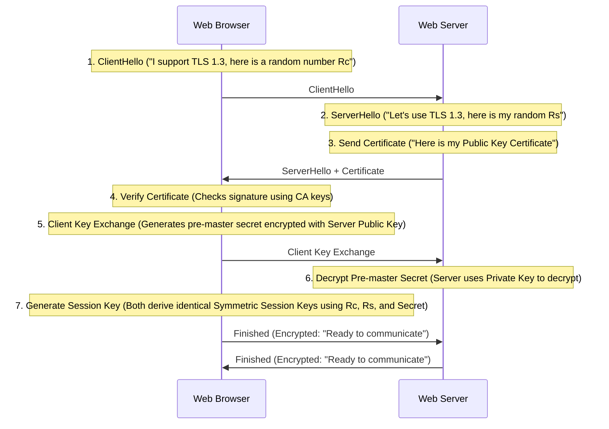
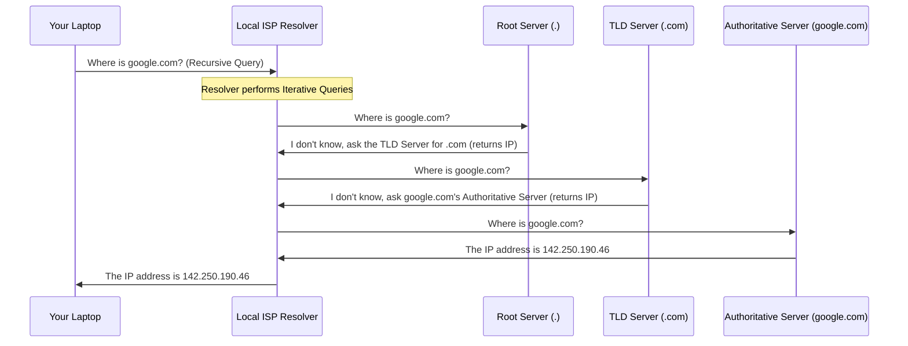

# 🔌 Computer Networks — Unit II: Complete In-Depth Notes

> **How to use these notes:** Read top to bottom. Every concept is explained with a simple analogy first, then the technical definition. Don't skip analogies — they are the key to truly *understanding* rather than just memorizing.

---

## 📌 Table of Contents

1. [Foundations of Computer Networks](#1-foundations-of-computer-networks)
2. [Network Topologies (ASCII Drawings & Math)](#2-network-topologies-ascii-drawings--math)
3. [Transmission Media & Physical Limits (Nyquist & Shannon Capacity)](#3-transmission-media-physical-principles)
4. [OSI & TCP/IP Reference Models & Flow/Error Control](#4-understanding-osi--tcpip-reference-models)
5. [In-Depth Protocol Headers (TCP, UDP, IPv4 & IPv6 Maps)](#5-in-depth-protocol-headers-tcp-vs-udp-map)
6. [IP Addressing, Subnetting Workbook & Supernetting](#6-ip-addressing--subnetting-workbook)
7. [Routing & Switching Algorithms](#7-routing--switching-algorithms)
8. [Key Protocols Handshakes, Congestion Control & TCP States](#8-key-protocols-handshakes--operations)

---

## 1. Foundations of Computer Networks

### 📮 The Postal Service vs. The Telephone Call (Connection Types)
Before computers, humans connected via two main networking architectures:
- **Circuit-Switched Networks (The Telephone Call):** When you dialed a number, a physical copper line was reserved exclusively for your call. If neither of you spoke, the line remained blocked. No one else could use it.
- **Packet-Switched Networks (The Postal Service):** When you send a letter, no road is reserved for you. Your letter is broken into a small card (packet), put in an envelope with a destination address, and sent along roads shared with trucks, cars, and other mail. 

> **Computer Networks are Packet-Switched.** Data is broken down into small units called **packets** and sent across shared communication paths.

---

### 🌐 1.1 Network Classifications

Networks are classified by the geographic area they span:

```
  [PAN: Personal] ──▶ [LAN: Local] ──▶ [MAN: Metropolitan] ──▶ [WAN: Wide Area]
  e.g., Bluetooth      e.g., Office     e.g., Smart City        e.g., Internet
  (10 meters)          (1 kilometer)    (50 kilometers)         (Global)
```

1.  **PAN (Personal Area Network):** Centered around a single person in a single location (range $\approx 10\text{ meters}$).
    - *Example:* Bluetooth connection between your phone and wireless earbuds.
2.  **LAN (Local Area Network):** Connects computers within a small geographic area (a single room, home, or office building). High speed, low error rates, privately owned.
    - *Example:* Your home Wi-Fi network.
3.  **MAN (Metropolitan Area Network):** Spans a larger area, such as a town or city (range $\approx 5\text{ to } 50\text{ kilometers}$).
    - *Example:* Cable TV network in a city, or municipal fiber networks.
4.  **WAN (Wide Area Network):** Spans large physical distances, connecting countries or continents. High error rate, lower speeds, owned by multiple public/private entities.
    - *Example:* The global Internet.

---

### 🤝 1.2 Distributed Systems vs. Computer Networks

```
  COMPUTER NETWORK                       DISTRIBUTED SYSTEM
 ┌─────────────────────────┐            ┌─────────────────────────┐
 │   Independent PCs       │            │   Independent PCs       │
 │   User explicitly       │            │   OS hides complexity;  │
 │   manages files/logins  │            │   user sees ONE system  │
 └─────────────────────────┘            └─────────────────────────┘
```

- **Computer Network:** The connection between computers is visible. The user must manually log into remote machines, copy files across the network, and manage connections.
- **Distributed System:** The connection between computers is invisible. A software layer (middleware) hides the network, presenting the user with a single, unified computer system. (e.g., Google Search queries are distributed over thousands of machines, but you only see one search bar).

---

### 🕸️ 1.3 Overlay Networks
An **Overlay Network** is a logical virtual network built on top of another physical network.
- Nodes in the overlay are connected by virtual links, which correspond to paths in the underlying physical network.
- *Examples:* Virtual Private Networks (VPNs), Peer-to-Peer (P2P) file-sharing networks (like BitTorrent), and Content Delivery Networks (CDNs).

---

## 2. Network Topologies (ASCII Drawings & Math)

A **Topology** defines the physical or logical layout of how devices are connected.

### 🕸️ 2.1 Mesh Topology

```
             [Node A]
            /   │    \
           /    │     \
   [Node C]─────┼──────[Node B]
     \    \    /      /
      \     \ /      /
       \─────┼──────/
            [Node D]
```

- **Dedicated Links:** Every node has a direct connection to every other node.
- **Cabling Math:** For $N$ nodes, the total number of duplex links ($L$) is:
  $$L = \frac{N(N-1)}{2}$$
- **Port Math:** Each node must have $N - 1$ physical I/O ports.
- **Security:** High, since traffic travels on dedicated, private channels.
- **Reliability:** High. No single point of failure.

---

### 🌟 2.2 Star Topology

```
           [Node A]
              │
   [Node C]──[Hub]──[Node B]
             / \
            /   \
     [Node D]   [Node E]
```

- **Central Controller:** All nodes connect to a central **Switch** or **Hub**.
- **Cabling Math:** For $N$ nodes, the total number of links is $N$.
- **Port Math:** Each node needs only 1 physical port. The central switch must have $N$ ports.
- **Single Point of Failure:** If the central switch/hub fails, the **entire network collapses**.

---

### 🚌 2.3 Bus Topology

```
    Terminator ───────── Backbone Cable ───────── Terminator
                     │           │           │
                 [Node A]    [Node B]    [Node C]
```

- **Single Line:** All nodes tap into a single backbone cable using **vampire taps** or **T-connectors**.
- **Terminators:** Placed at both ends of the backbone to absorb signals, preventing signal reflections that corrupt data.
- **Collisions:** High risk. Only one device can transmit at a time.

---

### ⭕ 2.4 Ring Topology

```
         ┌──▶ [Node A] ──┐
         │               ▼
      [Node D]        [Node B]
         ▲               │
         └─── [Node C] ◀─┘
```

- **Loop Link:** Each device is connected to its two immediate neighbors, forming a closed circle.
- **Token Passing:** A small frame (token) circulates around the ring. A device can only transmit data when it captures an empty token.
- **Reliability:** Low. A break in the cable or a node failure disrupts the entire ring.

---

### 🌲 2.5 Tree & Hybrid Topologies
- **Tree Topology:** A hierarchical structure combining star topologies connected via a main bus backbone. (Common in corporate offices).
- **Hybrid Topology:** Combines two or more distinct topologies (e.g., a **Star-Ring** network, where devices are physically wired in a star layout to a hub, but the hub routes signals internally in a circular ring).

---

## 3. Transmission Media (Physical Principles)

Transmission media carry data signals through physical cables (guided) or wireless waves (unguided).

### 🔌 3.1 Guided Media (Cables)

#### 1. Twisted Pair Cable

```
   Plastic Cover ────▶ ┌────────────────────────────────┐
   Twisted Wires ────▶ │  ( utp_wire1 )~~( utp_wire2 )  │
                       └────────────────────────────────┘
```

- **The Twisting Physics:** Copper wires carry electrical currents. A current creates an electromagnetic field, which can bleed into adjacent wires, causing noise (**crosstalk**). By twisting pairs of wires together, their opposing magnetic fields cancel each other out, reducing interference.
- **UTP (Unshielded Twisted Pair):** Standard LAN cable (Cat5e, Cat6). Cheap and flexible.
- **STP (Shielded Twisted Pair):** Encased in a metal foil shield to block extreme external noise.

---

#### 2. Coaxial Cable

```
  ┌────────────────────────────────────────────────────────┐
  │ [Jacket] [Metal Braid Shield] [Insulation] [Copper Core]│
  └────────────────────────────────────────────────────────┘
```

- **Structure:** Central copper core $\to$ plastic insulator dielectric $\to$ braided metal shield outer conductor $\to$ plastic jacket cover.
- **Use Case:** High-frequency applications like cable television, protecting high-frequency signals from external electromagnetic interference.

---

#### 3. Fiber Optic Cable

```
                    Cladding (Low refractive index)
                   ┌──────────────────────────────┐
  Light Ray ──▶  \  \  /  \  /  \  /  \  /  \  /  │
  ─────────────── \──\/──\/──\/──\/──\/──\/──\/───│  ← Total Internal Reflection
                 /  /  \  /  \  /  \  /  \  /  \  │
                 └──────────────────────────────┘
                    Core (High refractive index)
```

- **Total Internal Reflection:** Light travels inside a glass/plastic **Core** surrounded by a **Cladding** with a lower refractive index. When light hits the core-cladding boundary at an angle greater than the **critical angle**, it is reflected back into the core, propagating down the cable with minimal loss.
- **Single-Mode Fiber:** Ultra-thin core ($9\mu\text{m}$). Carries a single light ray generated by a laser. Low dispersion, supports extremely long distances.
- **Multi-Mode Fiber:** Thicker core ($50-62.5\mu\text{m}$). Carries multiple light rays generated by LEDs. High modal dispersion, limited to short distances.

---

### 📶 3.2 Unguided Media (Wireless)

#### 1. Radio Waves
- **Propagation:** Omnidirectional. Signals spread in all directions.
- **Frequency:** $3\text{ kHz}$ to $1\text{ GHz}$.
- **Physics:** Easily penetrates walls, but can be blocked by large metal objects. Excellent for long-range broadcasts.

#### 2. Microwaves
- **Propagation:** Unidirectional. Requires strict line-of-sight alignment between transmitting and receiving antennas.
- **Frequency:** $1\text{ GHz}$ to $300\text{ GHz}$.
- **Terrestrial vs. Satellite:** Terrestrial systems use line-of-sight towers spaced roughly 30 miles apart due to the Earth's curvature. Satellite systems relay signals using geosynchronous satellites orbit.

#### 3. Infrared
- **Propagation:** Short-range, line-of-sight.
- Frequency: $300\text{ GHz}$ to $400\text{ THz}$.
- Physics: Cannot penetrate walls. This prevents interference between adjacent rooms (e.g., your TV remote doesn't change your neighbor's channel).

---

### 📶 3.3 Channel Capacity & Physical Limits

When transmitting signals over physical media, we are limited by physics. Two fundamental theorems dictate the maximum data rate (capacity) of a channel:

#### 1. Nyquist Bit Rate (For Noiseless Channels)
*   **Analogy:** If you shout in a completely quiet room, the speed at which you can talk is limited only by how fast you can open and close your mouth (signal changes).
*   **Theorem:** For a noiseless channel with bandwidth $B$ and signal levels $L$, the maximum bit rate is:
    $$\text{Bit Rate} = 2 \times B \times \log_2(L)\text{ bits/sec}$$
*   **Worked Example:** A noiseless channel has a bandwidth of $3\text{ kHz}$ transmitting a signal with 4 levels.
    - $B = 3000\text{ Hz}$, $L = 4$.
    - $\text{Bit Rate} = 2 \times 3000 \times \log_2(4) = 6000 \times 2 = 12,000\text{ bps} = 12\text{ kbps}$.

#### 2. Shannon Capacity Theorem (For Noisy Channels)
*   **Analogy:** If you are talking in a crowded party with noise, your voice can only carry so much information before it gets drowned out. The louder the noise, the slower you must speak to be understood.
*   **Theorem:** The maximum theoretical data rate of a noisy channel with bandwidth $B$ and Signal-to-Noise Ratio ($\text{SNR}$) is:
    $$C = B \times \log_2(1 + \text{SNR})\text{ bits/sec}$$
*   **Decibel Note:** Typically, noise is given in Decibels ($\text{dB}$). Use the formula: $\text{SNR}_{\text{dB}} = 10 \log_{10}(\text{SNR})$.
*   **Worked Example:** A noisy channel has a bandwidth of $4\text{ kHz}$ and an SNR of $15\text{ dB}$.
    - First, convert $\text{dB}$ to absolute ratio: $15\text{ dB} = 10 \log_{10}(\text{SNR}) \implies 1.5 = \log_{10}(\text{SNR}) \implies \text{SNR} = 10^{1.5} \approx 31.62$.
    - $C = 4000 \times \log_2(1 + 31.62) = 4000 \times \log_2(32.62) \approx 4000 \times 5.028 \approx 20,112\text{ bps} \approx 20.1\text{ kbps}$.

---

## 4. Understanding OSI & TCP/IP Reference Models

Reference models define standard layers that network components use to communicate.

### 📦 4.1 Layer-by-Layer OSI Deep Dive

```
 ┌─────────────────┐
 │ 7. APPLICATION  │ ──▶ User Interface (HTTP: "Send GET request")
 ├─────────────────┤
 │ 6. PRESENTATION │ ──▶ Data Format, Compression, SSL/TLS Encryption
 ├─────────────────┤
 │   5. SESSION    │ ──▶ Manages sessions, inserts sync recovery checkpoints
 ├─────────────────┤
 │  4. TRANSPORT   │ ──▶ Segments data, manages flow/error control (TCP/UDP)
 ├─────────────────┤
 │   3. NETWORK    │ ──▶ IP routing, finds path across subnets (Packets)
 ├─────────────────┤
 │  2. DATA LINK   │ ──▶ Frame control, MAC Addressing, CSMA/CD checks
 ├─────────────────┤
 │   1. PHYSICAL   │ ──▶ Transmits raw bits over cables or air
 └─────────────────┘
```

#### The Encapsulation Process
When you send a message, it travels down the OSI stack. Each layer appends metadata (a header) to the payload:

```
  Application:      [ Hello ]
  Presentation:     [ Encrypted Hello ]
  Session:          [ Session Header ][ Encrypted Hello ]
  Transport:        [ TCP Header ][ Session ][ Encrypted Hello ]
  Network:          [ IP Header ][ TCP Header ][ Session ][ Encrypted Hello ]
  Data Link:        [ MAC Header ][ IP Header ][ TCP ][ Session ][ Hello ][ FCS ]
  Physical:         01101000 01100101 01101100 01101100 01101111 ...
```

---

### 4.2 TCP/IP model variations
The practical internet model consolidated the OSI layers into a simpler structure. Depending on the textbook, it is represented as a **4-layer** or **5-layer** model:

```
      OSI Model            TCP/IP (5-Layer)          TCP/IP (4-Layer)
 ┌─────────────────┐     ┌─────────────────┐       ┌─────────────────┐
 │   Application   │ ──▶ │   Application   │ ────▶ │                 │
 ├─────────────────┤     ├─────────────────┤       │   Application   │
 │  Presentation   │ ──▶ │  Presentation   │       │                 │
 ├─────────────────┤     ├─────────────────┤       └─────────────────┘
 │     Session     │ ──▶ │     Session     │
 ├─────────────────┤     ├─────────────────┤       ┌─────────────────┐
 │    Transport    │ ──▶ │    Transport    │ ────▶ │    Transport    │
 ├─────────────────┤     ├─────────────────┤       └─────────────────┘
 │     Network     │ ──▶ │    Network      │ ────▶ │    Internet     │
 ├─────────────────┤     ├─────────────────┤       └─────────────────┘
 │    Data Link    │ ──▶ │    Data Link    │ ────▶ │ Network Access  │
 │    Physical     │ ──▶ │    Physical     │       │ (Link Layer)    │
 └─────────────────┘     └─────────────────┘       └─────────────────┘
```

---

### 📦 4.3 Data Link Layer Flow & Error Control

The Data Link Layer ensures reliable hop-to-hop communication by managing **flow control** (preventing the sender from overwhelming the receiver) and **error control** (detecting/correcting frame corruption).

#### 1. Sliding Window Protocols
Instead of waiting for an acknowledgment (ACK) for every single frame before sending the next one (Stop-and-Wait), the sender maintains a "window" of frames it is allowed to send consecutively.

```
       STOP-AND-WAIT                      GO-BACK-N                    SELECTIVE REPEAT
  ┌──────────────────────┐        ┌──────────────────────┐        ┌──────────────────────┐
  │ Sender Window = 1    │        │ Sender Window = 2^k-1│        │ Sender Window = 2^(k-1)
  │ Receiver Window = 1  │        │ Receiver Window = 1  │        │ Receiver Window = W_s│
  │ Sends 1, waits ACK.  │        │ Discards out-of-order│        │ Buffers out-of-order │
  │ Very low efficiency  │        │ Resends whole window │        │ Resends lost frame   │
  └──────────────────────┘        └──────────────────────┘        └──────────────────────┘
```

#### Mathematical Efficiency ($\eta$)
For a link with propagation delay $T_p$ and transmission delay $T_t$, the efficiency $\eta$ is:
$$\eta = \frac{N \times T_t}{T_t + 2T_p}$$
where $N$ is the sender window size.
*   For **Stop-and-Wait**, $N = 1 \implies \eta = \frac{T_t}{T_t + 2T_p} = \frac{1}{1 + 2a}$ where $a = T_p / T_t$.
*   For maximum efficiency ($\eta = 100\%$), the window size $N$ must be:
    $$N \ge 1 + 2a = 1 + \frac{2T_p}{T_t}$$

#### 2. Media Access Control (ALOHA & CSMA/CD)
*   **Pure ALOHA:** Any node transmits immediately. If a collision occurs, it waits a random backoff time.
    - Vulnerable Time: $2 \times T_f$.
    - Maximum Throughput: $18.4\%$ (occurs at load $G = 0.5$).
*   **Slotted ALOHA:** Time is divided into discrete slots. Nodes can only transmit at the beginning of a slot.
    - Vulnerable Time: $T_f$.
    - Maximum Throughput: $36.8\%$ (occurs at load $G = 1.0$).
*   **CSMA/CD (Carrier Sense Multiple Access with Collision Detection):**
    - Enforced in wired Ethernet (802.3).
    - Router senses the line. If idle, it transmits. If a collision is detected, it stops immediately, sends a **jam signal**, and enters **Binary Exponential Backoff**:
      - Wait time = $r \times \text{Slot Time}$, where $r \in [0, 2^c - 1]$ and $c$ is the number of collisions.

---

## 5. In-Depth Protocol Headers (TCP vs. UDP Map)

The Transport Layer uses two primary protocols: **TCP** (reliable, connection-oriented) and **UDP** (unreliable, connectionless). Their headers reflect these differences.

### ✉️ 5.1 The TCP Header (20 to 60 Bytes)
TCP includes extensive metadata to manage sequence numbers, acknowledgments, window sizes, and flags:

```
 0                   1                   2                   3
 0 1 2 3 4 5 6 7 8 9 0 1 2 3 4 5 6 7 8 9 0 1 2 3 4 5 6 7 8 9 0 1
├───────────────────────────────┬───────────────────────────────┤
│          Source Port          │       Destination Port        │
├───────────────────────────────┴───────────────────────────────┤
│                        Sequence Number                        │
├───────────────────────────────────────────────────────────────┤
│                     Acknowledgment Number                     │
├───────┬───────┬─┬─┬─┬─┬─┬─┬─┬─┬───────────────────────────────┤
│ Data  │  Res  │N│C│E│U│A│P│R│S│F│          Window Size          │
│Offset │       │S│W│C│R│C│S│S│Y│I│                               │
│       │       │ │R│E│G│K│H│T│N│N│                               │
├───────┴───────┴─┴─┴─┴─┴─┴─┴─┴─┴─┼───────────────────────────────┤
│           Checksum            │        Urgent Pointer         │
├───────────────────────────────┴───────────────────────────────┤
│                    Options (0 to 40 bytes)                    │
└───────────────────────────────────────────────────────────────┘
```

#### Field Explanations:
*   **Sequence Number (32-bit):** The byte stream number of the first data byte in this segment. Used to reorder packets at the destination.
*   **Acknowledgment Number (32-bit):** The next byte number the sender expects to receive.
*   **Data Offset (4-bit):** Specifies the size of the TCP header in 32-bit words, helping the receiver identify where the actual data payload starts.
*   **Flags (9-bit):**
    *   `SYN` (Synchronize): Used during connection establishment.
    *   `ACK` (Acknowledgment): Confirms receipt of packets.
    *   `FIN` (Finish): Used to terminate a connection.
    *   `RST` (Reset): Abruptly terminates a connection.
    *   `PSH` (Push): Tells the receiver to pass data to the application layer immediately instead of buffering it.
    *   `URG` (Urgent): Indicates urgent data (prioritized using the Urgent Pointer).
*   **Window Size (16-bit):** Used for **flow control** (tells the sender how many bytes the receiver's buffer can accept before waiting for an ACK).

---

### ✉️ 5.2 The UDP Header (Fixed 8 Bytes)
UDP is designed for speed. It has minimal overhead, containing only 4 fields:

```
 0                   1                   2                   3
 0 1 2 3 4 5 6 7 8 9 0 1 2 3 4 5 6 7 8 9 0 1 2 3 4 5 6 7 8 9 0 1
├───────────────────────────────┬───────────────────────────────┤
│          Source Port          │       Destination Port        │
├───────────────────────────────┼───────────────────────────────┤
│            Length             │           Checksum            │
└───────────────────────────────┴───────────────────────────────┘
```

*   **Length (16-bit):** The total size of the UDP segment (header + data) in bytes.
*   **Checksum (16-bit):** Used to check for transmission errors.

---

### ✉️ 5.3 IPv4 vs. IPv6 Header Structures

While TCP and UDP operate at Layer 4, the Network Layer (Layer 3) handles IP packet routing. 

#### IPv4 Header (20 to 60 Bytes)
```
 0                   1                   2                   3
 0 1 2 3 4 5 6 7 8 9 0 1 2 3 4 5 6 7 8 9 0 1 2 3 4 5 6 7 8 9 0 1
├───────┬───────┬───────────────┬───────────────────────────────┤
│Version│  IHL  │Type of Service│         Total Length          │
├───────┴───────┴───────────────┼─┬─┬───────────────────────────┤
│        Identification         │D│M│      Fragment Offset      │
│                               │F│F│                           │
├───────────────┬───────────────┼─┴─┴───────────────────────────┤
│ Time to Live  │   Protocol    │        Header Checksum        │
├───────────────┴───────────────┴───────────────────────────────┤
│                        Source IP Address                      │
├───────────────────────────────────────────────────────────────┤
│                     Destination IP Address                    │
├───────────────────────────────────────────────────────────────┤
│                    Options (0 to 40 bytes)                    │
└───────────────────────────────────────────────────────────────┘
```

#### IPv6 Header (Fixed 40 Bytes)
IPv6 simplified the header layout by removing fields like Checksum, Identification, and Flags. It uses fixed sizes to speed up router processing.

```
 0                   1                   2                   3
 0 1 2 3 4 5 6 7 8 9 0 1 2 3 4 5 6 7 8 9 0 1 2 3 4 5 6 7 8 9 0 1
├───────┬───────────────┬───────────────────────────────────────┤
│Version│ Traffic Class │              Flow Label               │
├───────┴───────────────┼───────────────┬───────────────────────┤
│    Payload Length     │  Next Header  │       Hop Limit       │
├───────────────────────┴───────────────┴───────────────────────┤
│                                                               │
│                       Source IP Address                       │
│                           (128-bit)                           │
│                                                               │
├───────────────────────────────────────────────────────────────┤
│                                                               │
│                    Destination IP Address                     │
│                           (128-bit)                           │
│                                                               │
└───────────────────────────────────────────────────────────────┘
```

#### Key Differences:
*   **Address Size:** IPv4 uses 32-bit addresses, while IPv6 uses 128-bit addresses.
*   **Checksum:** IPv4 has a header checksum; IPv6 has **no header checksum** (relying on Layer 2 and Layer 4 to handle errors, reducing router overhead).
*   **Fragmentation:** In IPv4, routers fragment packets mid-transit. In IPv6, **routers do not fragment packets**; the sending host must perform path MTU discovery and fragment beforehand.
*   **Next Header:** In IPv6, this field replaces IPv4's Protocol field and supports daisy-chaining optional "Extension Headers" (like security/IPsec) without bloating the base header.

---

## 6. IP Addressing & Subnetting Workbook

### 🗺️ 6.1 Subnetting Worked Example 1 (Class C /27)

Task: Divide **`192.168.10.0 /27`** into subnets.

```
Step 1: Check Prefix Length
        - Prefix is /27.
        - Default Class C prefix is /24.
        - Borrowed bits (s) = 27 - 24 = 3 bits.
        - Remaining host bits (h) = 32 - 27 = 5 bits.

Step 2: Calculate Subnet & Host counts
        - Subnets = 2^s = 2^3 = 8 subnets.
        - Total Hosts per subnet = 2^h = 2^5 = 32 addresses.
        - Usable Hosts per subnet = 2^h - 2 = 30 addresses.

Step 3: Calculate Subnet Mask
        - The borrowed 3 bits in the 4th octet: (11100000 in binary).
        - 128 + 64 + 32 = 224.
        - Subnet Mask = 255.255.255.224.

Step 4: Find the block size (spacing)
        - Block size = 2^h = 2^5 = 32.
        - Subnets start at increments of 32.
```

#### Subnet Map (First 3 of 8 Subnets)
*   **Subnet 0:**
    *   Network ID: `192.168.10.0`
    *   First Usable Host: `192.168.10.1`
    *   Last Usable Host: `192.168.10.30`
    *   Broadcast ID: `192.168.10.31`
*   **Subnet 1:**
    *   Network ID: `192.168.10.32`
    *   First Usable Host: `192.168.10.33`
    *   Last Usable Host: `192.168.10.62`
    *   Broadcast ID: `192.168.10.63`
*   **Subnet 2:**
    *   Network ID: `192.168.10.64`
    *   First Usable Host: `192.168.10.65`
    *   Last Usable Host: `192.168.10.94`
    *   Broadcast ID: `192.168.10.95`

---

### 🗺️ 6.2 Subnetting Worked Example 2 (Class B /22)

Task: Divide **`172.16.0.0 /22`** into subnets.

```
Step 1: Check Prefix Length
        - Prefix is /22.
        - Default Class B prefix is /16.
        - Borrowed bits (s) = 22 - 16 = 6 bits.
        - Remaining host bits (h) = 32 - 22 = 10 bits.

Step 2: Calculate Subnet & Host counts
        - Subnets = 2^s = 2^6 = 64 subnets.
        - Total Hosts per subnet = 2^10 = 1024 addresses.
        - Usable Hosts per subnet = 1024 - 2 = 1022 addresses.

Step 3: Calculate Subnet Mask
        - The borrowed 6 bits in the 3rd octet: (11111100 in binary).
        - 128 + 64 + 32 + 16 + 8 + 4 = 252.
        - Subnet Mask = 255.255.252.0.

Step 4: Find the block size (spacing)
        - Since host bits (10) exceed 8, the spacing is in the 3rd octet.
        - Spacing size = 2^(10 - 8) = 2^2 = 4.
        - Subnets start at increments of 4 in the 3rd octet.
```

#### Subnet Map (First 3 of 64 Subnets)
*   **Subnet 0:**
    *   Network ID: `172.16.0.0`
    *   First Usable Host: `172.16.0.1`
    *   Last Usable Host: `172.16.3.254`
    *   Broadcast ID: `172.16.3.255`
*   **Subnet 1:**
    *   Network ID: `172.16.4.0`
    *   First Usable Host: `172.16.4.1`
    *   Last Usable Host: `172.16.7.254`
    *   Broadcast ID: `172.16.7.255`
*   **Subnet 2:**
    *   Network ID: `172.16.8.0`
    *   First Usable Host: `172.16.8.1`
    *   Last Usable Host: `172.16.11.254`
    *   Broadcast ID: `172.16.11.255`

---

### 🗺️ 6.3 Subnetting Worked Example 3 (Class C /26)

Task: Divide **`192.168.1.0 /26`** into subnets.

```
Step 1: Check Prefix Length
        - Prefix is /26.
        - Default Class C prefix is /24.
        - Borrowed bits (s) = 26 - 24 = 2 bits.
        - Remaining host bits (h) = 32 - 26 = 6 bits.

Step 2: Calculate Subnet & Host counts
        - Subnets = 2^s = 2^2 = 4 subnets.
        - Total Hosts per subnet = 2^h = 2^6 = 64 addresses.
        - Usable Hosts per subnet = 2^6 - 2 = 62 addresses.

Step 3: Calculate Subnet Mask
        - The borrowed 2 bits in the 4th octet: (11000000 in binary).
        - 128 + 64 = 192.
        - Subnet Mask = 255.255.255.192.

Step 4: Find the block size (spacing)
        - Spacing = 2^h = 2^6 = 64.
        - Subnets start at increments of 64.
```

#### Subnet Map (All 4 Subnets)
*   **Subnet 0:**
    *   Network ID: `192.168.1.0`
    *   First Usable Host: `192.168.1.1`
    *   Last Usable Host: `192.168.1.62`
    *   Broadcast ID: `192.168.1.63`
*   **Subnet 1:**
    *   Network ID: `192.168.1.64`
    *   First Usable Host: `192.168.1.65`
    *   Last Usable Host: `192.168.1.126`
    *   Broadcast ID: `192.168.1.127`
*   **Subnet 2:**
    *   Network ID: `192.168.1.128`
    *   First Usable Host: `192.168.1.129`
    *   Last Usable Host: `192.168.1.190`
    *   Broadcast ID: `192.168.1.191`
*   **Subnet 3:**
    *   Network ID: `192.168.1.192`
    *   First Usable Host: `192.168.1.193`
    *   Last Usable Host: `192.168.1.254`
    *   Broadcast ID: `192.168.1.255`

---

### 🌐 6.4 Supernetting (CIDR Address Aggregation)

*   **Analogy:** A post office clerk consolidating mail sacks. Instead of maintaining 4 separate sacks for "Block A, Street 1", "Block A, Street 2", "Block A, Street 3", and "Block A, Street 4", the clerk aggregates them into a single sack labeled "Block A, Streets 1-4".
*   **Technical Definition:** Combining multiple smaller networks (subnets) into a single larger network (supernet) by summarizing their routing paths. This keeps routing tables small and clean.

#### Worked Example:
Combine these four subnets:
1. `192.168.0.0/24`
2. `192.168.1.0/24`
3. `192.168.2.0/24`
4. `192.168.3.0/24`

```
Step 1: Convert the changing octets to binary.
        Here, the 3rd octet changes (0, 1, 2, 3):
        - Subnet 0: 0 = 0 0 0 0 0 0 0 0
        - Subnet 1: 1 = 0 0 0 0 0 0 0 1
        - Subnet 2: 2 = 0 0 0 0 0 0 1 0
        - Subnet 3: 3 = 0 0 0 0 0 0 1 1

Step 2: Find the matching bits.
        Notice that the first 6 bits of the 3rd octets are identical (000000xx).
        So, 6 bits are matching.

Step 3: Calculate the new subnet prefix length.
        New Prefix = Original Prefix (24) - Unmatched bits (2) = 22 bits.

Step 4: Form the aggregated supernet.
        The prefix is /22, and the starting address is 192.168.0.0.
        Aggregated Address = 192.168.0.0/22.
```

---

## 7. Routing & Switching Algorithms

### 🔀 7.1 Switch vs. Router

```
  LAYER 2 SWITCH                         LAYER 3 ROUTER
 ┌─────────────────────────┐            ┌─────────────────────────┐
 │   Uses MAC Addresses    │            │   Uses IP Addresses     │
 │   Connects devices in   │            │   Connects separate     │
 │   the same subnet       │            │   subnets/networks      │
 └─────────────────────────┘            └─────────────────────────┘
```

- **Switch (Layer 2):** Uses a MAC table (CAM table) to forward frames to specific ports in the local network. 
- **Router (Layer 3):** Uses a routing table to forward packets across different subnets.

---

### 🗺️ 7.2 Distance Vector Routing & Loops

Distance Vector routing uses the **Bellman-Ford equation** to calculate distances:

$$D_x(y) = \min_v \{c(x,v) + D_v(y)\}$$

where $c(x,v)$ is the cost of the link from node $x$ to neighbor $v$, and $D_v(y)$ is neighbor $v$'s cost estimate to destination $y$.

#### The Count-to-Infinity Problem

```
  [Node A] ──(cost 1)── [Node B] ──(cost 1)── [Node C]
```

1.  Initially, Node B knows it can reach Node A in 1 hop. Node C knows it can reach Node A via Node B in 2 hops.
2.  If the link between A and B breaks:
    - Node B sees A is down (cost = $\infty$).
    - However, C's update arrives at B: *"I can reach A in 2 hops."*
    - Node B thinks: *"Excellent! I can reach A via C in $2 + 1 = 3$ hops."*
    - Node B updates its table: $B \to A = 3$ hops.
    - On the next cycle, C hears B can reach A in 3 hops, so C updates its table: $C \to A = 4$ hops.
    - They keep counting up to infinity ($\infty$), creating a routing loop!

#### Solutions:
- **Split Horizon:** A router cannot advertise a route back out the same interface it learned it from. (e.g., Node C will not tell Node B that it can reach Node A through Node B).
- **Poison Reverse:** A router advertises a failed route back to its neighbor with an infinite cost ($\infty$).

---

### 🗺️ 7.3 Link State Routing: Dijkstra's Step-by-Step Trace

Let's trace Dijkstra's algorithm to find the shortest path from **Source Node A** to all other nodes in this graph:

```
         (2)
      ┌─────── B ───────┐
      │       │         │
    A │       │ (3)     │ (1)
      │       │         │
      └─────── C ─────── D
         (5)      (2)
```

- **Nodes:** A, B, C, D
- **Edges:** $A-B$ (2), $A-C$ (5), $B-C$ (3), $B-D$ (1), $C-D$ (2)

#### Tracing State Variables:
*   `Visited` set: Tracks nodes with finalized paths.
*   `Distance` vector: `[Dist(A), Dist(B), Dist(C), Dist(D)]`.

#### Initialization:
- `Visited` = $\{\}$
- `Dist` = `[0, ∞, ∞, ∞]`

---

#### Step 1:
- Select the unvisited node with the minimum distance: **Node A** ($Dist = 0$).
- Add A to `Visited` = $\{A\}$.
- Update distances to A's neighbors:
  - $Dist(B) = \min(\infty, 0 + c(A,B)) = 0 + 2 = 2$.
  - $Dist(C) = \min(\infty, 0 + c(A,C)) = 0 + 5 = 5$.
- Current `Dist` = `[0, 2, 5, ∞]`.

---

#### Step 2:
- Select the unvisited node with the minimum distance: **Node B** ($Dist = 2$).
- Add B to `Visited` = $\{A, B\}$.
- Update distances to B's neighbors:
  - $Dist(C) = \min(5, 2 + c(B,C)) = \min(5, 2 + 3) = 5$.
  - $Dist(D) = \min(\infty, 2 + c(B,D)) = \min(\infty, 2 + 1) = 3$.
- Current `Dist` = `[0, 2, 5, 3]`.

---

#### Step 3:
- Select the unvisited node with the minimum distance: **Node D** ($Dist = 3$).
- Add D to `Visited` = $\{A, B, D\}$.
- Update distances to D's neighbors:
  - $Dist(C) = \min(5, 3 + c(D,C)) = \min(5, 3 + 2) = 5$.
- Current `Dist` = `[0, 2, 5, 3]`.

---

#### Step 4:
- Select the unvisited node with the minimum distance: **Node C** ($Dist = 5$).
- Add C to `Visited` = $\{A, B, D, C\}$.
- All nodes are visited.

#### Final Shortest Paths from A:
*   To B: **2** (via $A \to B$)
*   To C: **5** (via $A \to C$)
*   To D: **3** (via $A \to B \to D$)

---

## 8. Key Protocols Handshakes & Operations

### 🌐 8.1 HTTPS SSL/TLS Cryptographic Handshake

HTTPS uses SSL/TLS to encrypt communications, establishing keys using a handshake protocol:



Once the handshake is complete, data is encrypted using high-speed symmetric algorithms (like AES) with the shared Session Key.

---

### 📞 8.2 DNS Resolution Walk: Recursive vs. Iterative

When you search for `google.com`, your computer queries the DNS system:



- **Recursive Query:** The client asks the resolver to do all the work and return the final answer.
- **Iterative Query:** The resolver queries servers step-by-step. Each server returns a referral pointer to the next server in the hierarchy.

---

### 📂 8.3 FTP: Active vs. Passive Modes
FTP separates commands and data using two separate channels:
*   **Active Mode:**
    1.  Client opens a control connection on Port 21 and sends a command: *"I am listening on port $P$."*
    2.  The Server initiates a connection back to the client from Port 20 to the client's port $P$ to transfer data.
    - *Issue:* Client-side firewalls typically block incoming connection requests from external servers.
*   **Passive Mode (Firewall Friendly):**
    1.  Client opens control connection on Port 21 and sends a command: *"Use passive mode."*
    2.  The Server opens a random port $S$ and replies: *"Connect to me on port $S$."*
    3.  The Client initiates the data connection from its own random port to the server's port $S$.

---

### 🏎️ 8.4 TCP Congestion Control and State Transitions

To prevent a fast sender from flooding the intermediate routers (which differs from flow control, where the sender is restricted by the receiver's buffer space), TCP uses congestion control.

```
       TCP CONGESTION CONTROL TIMELINE
  cwnd (MSS)
    ▲
 16 │                 / \   ← ssthresh (Threshold hit, enter Avoidance)
    │                /   \
  8 │       /       /     \
    │      /       /       \
  4 │    /        /         \
    │   /        /           \
  1 └──/────────/─────────────\────▶ Time
     Slow    Avoidance      Timeout
     Start   (Linear)       Reset to 1
```

#### The Four Phases:
1.  **Slow Start:**
    - Begins with a small congestion window (`cwnd = 1 MSS`).
    - The window doubles every Round Trip Time (RTT) ($1 \to 2 \to 4 \to 8 \to 16$).
    - Continues until `cwnd` reaches the slow start threshold (`ssthresh`).
2.  **Congestion Avoidance:**
    - Once `cwnd >= ssthresh`, exponential growth stops.
    - The window grows linearly, increasing by $1\text{ MSS}$ per RTT.
3.  **Fast Retransmit:**
    - If the sender receives **3 duplicate ACKs** for a segment, it assumes the segment was lost and retransmits it immediately without waiting for the timeout timer to expire.
4.  **Fast Recovery:**
    - Upon receiving 3 duplicate ACKs, `ssthresh` is set to $\frac{\text{cwnd}}{2}$, `cwnd` is set to the new `ssthresh`, and the sender enters Congestion Avoidance directly (skipping Slow Start).
    - Note: If a **timeout** occurs instead of duplicate ACKs, `cwnd` is reset back to 1 MSS, and the sender enters Slow Start.

#### 📞 8.5 TCP State Transition Table

The TCP protocol operates as a Finite State Machine (FSM). Below are the primary states during a socket's lifecycle:

| TCP State | Mode | Description |
| :--- | :--- | :--- |
| **LISTEN** | Server | Waiting for a connection request from any remote client. |
| **SYN-SENT** | Client | Sent a connection request (`SYN`) and is waiting for a matching connection request. |
| **SYN-RECEIVED** | Server | Received a connection request (`SYN`), sent a response (`SYN-ACK`), and is waiting for a final `ACK`. |
| **ESTABLISHED** | Both | Connection is fully established; data transfer is active. |
| **FIN-WAIT-1** | Both | Sent a close request (`FIN`) and is waiting for a connection termination request or acknowledgment. |
| **FIN-WAIT-2** | Both | Received an acknowledgment (`ACK`) for its own `FIN`, waiting for the other side's `FIN`. |
| **CLOSE-WAIT** | Both | Received a `FIN` from the peer, sent an `ACK`. Waiting for local application to close. |
| **LAST-ACK** | Both | Sent its own final `FIN` after being in CLOSE-WAIT, waiting for final `ACK`. |
| **TIME-WAIT** | Both | Waiting for twice the Maximum Segment Lifetime (2MSL) to ensure the remote peer received the final `ACK`. |
| **CLOSED** | Both | No connection state; end of lifecycle. |
