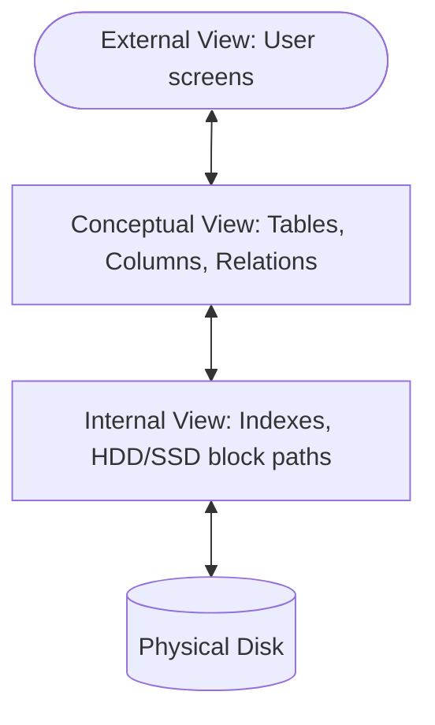
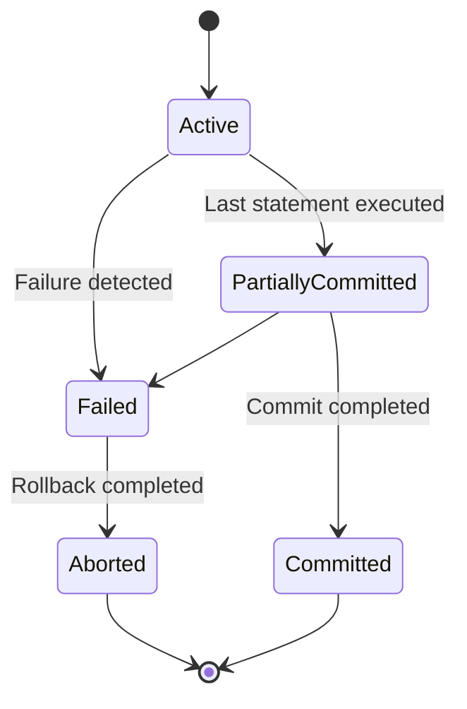

# 🗄️ DBMS — Unit III: Complete Beginner-Friendly Notes

> **How to use these notes:** Read top to bottom. Every concept is explained with a simple analogy first, then the technical definition. Don't skip analogies — they are the key to truly *understanding* rather than just memorizing.

---

## 📌 Table of Contents

1. [What is a Database & DBMS?](#1-what-is-a-database--dbms)
2. [Three-Schema Architecture](#2-three-schema-architecture)
3. [Relational Model Concepts & Integrity Constraints](#3-relational-model-concepts)
4. [Relational Database Keys & Key Counting Math](#4-relational-database-keys)
5. [SQL Classifications & Joins](#5-sql-classifications--joins)
6. [Database Normalization](#6-database-normalization)
7. [Transaction Management & ACID](#7-transaction-management--acid)
8. [Concurrency Control & Locking](#8-concurrency-control--locking)
9. [Concurrency Anomalies (Dirty, Non-Repeatable & Phantom Reads)](#9-concurrency-anomalies-dirty-non-repeatable--phantom-reads)
10. [Conflict Serializability & Precedence Graphs](#10-conflict-serializability--precedence-graphs)
11. [Database Recovery Systems (WAL, Checkpoints & REDO/UNDO)](#11-database-recovery-systems-wal-checkpoints--redoundo)
12. [Common Pitfalls & Mistakes to Avoid](#12-common-pitfalls--mistakes-to-avoid)

---

## 1. What is a Database & DBMS?

### 📁 The Office File Cabinet Analogy

Imagine a company that tracks employee records using physical folders in a **filing cabinet**:
- If someone's address changes, you must manually find and update every sheet of paper mentioning it. If you miss one sheet, you have **data inconsistency**.
- Two managers can't read the same file folder simultaneously without fighting over it (**concurrency issues**).
- There is no password protecting individual sheets inside a folder (**security issues**).

```
  Traditional File System                      Modern DBMS
 ┌─────────────────────────┐                  ┌─────────────────────────┐
 │   [Folder 1: Payroll]   │                  │   ┌─────────────────┐   │
 │   [Folder 2: Contact]   │                  │   │   CENTRALIZED   │   │
 │                         │                  │   │    DATABASE     │   │
 │   Duplicate names and   │                  │   └─────────────────┘   │
 │  inconsistent addresses │                  │   Single source of truth│
 └─────────────────────────┘                  └─────────────────────────┘
```

> **Technical Definition:** A Database is an organized collection of structured data. A **Database Management System (DBMS)** is system software that enables users to create, maintain, retrieve, search, and protect this data, resolving redundancy and concurrency conflicts.

---

## 2. Three-Schema Architecture

**Analogy:** Think of an **online banking app**:
- **You (Customer)** only see your account balance on a clean screen (**External Schema**).
- **The Database Architect** sees the layout of the tables, security limits, and how customer data relates to transaction history (**Conceptual Schema**).
- **The Server Technician** sees that the database files are saved as partitions on SSD arrays in a data center (**Internal Schema**).



### Data Independence
The three-schema architecture provides two levels of data independence:
1.  **Logical Data Independence:** The ability to change the conceptual schema (e.g., adding a new table column) without affecting the external schema (user screens/application programs).
2.  **Physical Data Independence:** The ability to change the physical/internal schema (e.g., migrating files from HDD to SSD, adding indexing) without affecting the conceptual or logical schema.

---

## 3. Relational Model Concepts

In the Relational Model (RDBMS), data is represented as a collection of **Tables (Relations)**.

```
Table: Employees (Relation)
┌────────┬─────────────┬──────────┐
│ EMP_ID │  EMP_NAME   │  SALARY  │  ← Columns (Attributes)
├────────┼─────────────┼──────────┤
│  101   │ Alice Smith │ 90000.00 │  ← Row (Tuple)
│  102   │ Bob Jones   │ 60000.00 │  ← Row (Tuple)
└────────┴─────────────┴──────────┘
```

*   **Attribute:** A column header (represents a field).
*   **Tuple:** A single row of data (represents a record).
*   **Domain:** The set of permitted values for each attribute (e.g., `SALARY` must be a positive decimal).
*   **Degree:** The number of columns/attributes in a table. (Here, $\text{Degree} = 3$).
*   **Cardinality:** The number of rows/tuples currently in the table. (Here, $\text{Cardinality} = 2$).

---

### 🛡️ 3.1 Data Integrity Constraints

Integrity constraints are rules defined to keep database data accurate, consistent, and reliable. Think of them as the **legal code** of the database.

```
       ┌─────────────────────────────────────────────────────────┐
       │                 INTEGRITY CONSTRAINTS                   │
       └─────────────────────────────────────────────────────────┘
                    │                 │                 │
                    ▼                 ▼                 ▼
             [Domain Integrity] [Entity Integrity] [Referential Integrity]
             Type/Range rules   PK cannot be NULL   FK must match a PK or NULL
```

1.  **Domain Integrity:**
    - **Analogy:** Entering your age as "Banana" or "-45" is rejected.
    - **Technical Definition:** Restricts the values that can be inserted into a column. It is enforced by specifying a data type (e.g., `INT`, `VARCHAR`), declaring standard `CHECK` constraints (e.g., `CHECK (Age >= 18)`), or setting fields as `NOT NULL`.
2.  **Entity Integrity:**
    - **Analogy:** Every citizen must have a unique, non-null Social Security Number. You cannot exist in the government database as an anonymous "null".
    - **Technical Definition:** Declares that **no primary key column can contain a NULL value**. Since primary keys uniquely identify tuples, allowing NULL would mean we cannot uniquely identify that record.
3.  **Referential Integrity:**
    - **Analogy:** If you are assigned to "Office Room 102", Room 102 must actually exist in the office building directory. If Room 102 is demolished, either your assignment must be changed (updated) or you cannot be assigned to it in the first place.
    - **Technical Definition:** Enforces relationships between tables. A **Foreign Key** in a referencing relation must either match a valid **Primary Key** value in the referenced relation, or be set to `NULL`.
    - **Violations Handled by:**
      - `ON DELETE CASCADE`: If the referenced row is deleted, automatically delete the referencing rows.
      - `ON DELETE SET NULL`: If the referenced row is deleted, set foreign key fields in referencing rows to NULL.
      - `ON DELETE RESTRICT/NO ACTION`: Reject the delete request if referencing rows exist.

---

## 4. Relational Database Keys

**Analogy:** Security clearance badges in a high-security facility:
- **Super Key:** Any collection of badge credentials (like Employee ID + Shirt Color) that uniquely identifies a person.
- **Candidate Key:** The minimal collection of credentials (just Employee ID) that identifies you. If you remove the ID, you can no longer be identified.
- **Primary Key:** The official ID badge chosen by the company to identify you.

```
   SUPER KEY       ──▶ Any set of attributes that uniquely identifies a row.
       │               (e.g., {EMP_ID, EMAIL}, {EMP_ID, EMP_NAME})
       ▼
 CANDIDATE KEY     ──▶ A minimal Super Key. (e.g., {EMP_ID}, {EMAIL})
       │
       ▼
  PRIMARY KEY      ──▶ The selected Candidate Key. (Cannot be NULL).
```

*   **Alternate Key:** Candidate keys that were not chosen as the primary key.
*   **Foreign Key:** An attribute in a table that references the primary key of another table, establishing a link. It enforces **Referential Integrity**.

---

### 🧮 4.1 Key Count Calculations (Mathematical Formulas & Examples)

In technical interviews (especially GATE or university exams), you will be asked to compute the **maximum and minimum possible numbers of Super Keys** or Candidate Keys for a given schema.

Let's walk through the math step-by-step.

#### Core Formula Setup
Let a relation schema $R(A_1, A_2, A_3, \dots, A_n)$ contain $n$ attributes.
*   A **Super Key (SK)** must contain at least one **Candidate Key (CK)**.
*   Any combination of the remaining attributes can be added to a Candidate Key to form a Super Key.
*   Since each of the remaining attributes has 2 choices (either include it in the key or exclude it), we use powers of 2.

```
                  ┌────────────────────────────────────────┐
                  │   If Candidate Key has 'k' attributes  │
                  │   Number of Super Keys = 2^(n - k)      │
                  └────────────────────────────────────────┘
```

---

#### Case 1: Schema has exactly ONE Candidate Key of size $k$
*   **Formula:** $\text{Total Super Keys} = 2^{n-k}$
*   **Worked Example:** Let $R(A, B, C, D, E)$ have $n=5$ attributes. Let the only Candidate Key be $\{A\}$. Here, $k=1$.
    - The key attributes are $\{A\}$ (must be included).
    - The non-key attributes are $\{B, C, D, E\}$ (4 attributes).
    - Each of these 4 attributes can either be present or absent: $2^4 = 16$.
    - Hence, there are **16** possible super keys: $\{A\}$, $\{A, B\}$, $\{A, C\}$, $\{A, B, C\}$, etc.

---

#### Case 2: Schema has MULTIPLE Candidate Keys (Inclusion-Exclusion Principle)
When a schema has multiple candidate keys, some super keys might contain key $CK_1$, some might contain $CK_2$, and some might contain both. To avoid double-counting, we use the **Principle of Inclusion-Exclusion (PIE)**:

$$|CK_1 \cup CK_2| = |CK_1| + |CK_2| - |CK_1 \cap CK_2|$$

*   **Worked Example:** Let $R(A, B, C, D)$ have $n=4$ attributes. Let the Candidate Keys be $\{A\}$ and $\{B\}$.
    - Number of super keys containing $\{A\}$: $2^{4 - 1} = 2^3 = 8$.
    - Number of super keys containing $\{B\}$: $2^{4 - 1} = 2^3 = 8$.
    - Number of super keys containing both $\{A, B\}$ (the intersection): Since $\{A, B\}$ contains 2 attributes, the remaining attributes are $\{C, D\}$. So, $2^{4 - 2} = 2^2 = 4$.
    - Total Super Keys = $8 + 8 - 4 = 12$.

*   **Complex Example (Composite Candidate Keys):** Let $R(A, B, C, D)$ have $n=4$ attributes. Let the Candidate Keys be $\{AB\}$ and $\{C\}$.
    - Number of super keys containing $\{AB\}$ (size 2): $2^{4 - 2} = 2^2 = 4$.
    - Number of super keys containing $\{C\}$ (size 1): $2^{4 - 1} = 2^3 = 8$.
    - Number of super keys containing both $\{AB\}$ and $\{C\}$: The union $\{A, B, C\}$ has size 3. Remaining attributes = $\{D\}$. So, $2^{4 - 3} = 2^1 = 2$.
    - Total Super Keys = $4 + 8 - 2 = 10$.

---

## 5. SQL Classifications & Joins

### 5.1 SQL Categories

SQL commands are grouped based on their target level of operations:

| Category | Stands For | Purpose | Key Commands |
| :--- | :--- | :--- | :--- |
| **DDL** | Data Definition Language | Defines and alters database structure. | `CREATE`, `ALTER`, `DROP`, `TRUNCATE` |
| **DML** | Data Manipulation Language | Accesses and modifies row data. | `SELECT`, `INSERT`, `UPDATE`, `DELETE` |
| **DCL** | Data Control Language | Manages access rights and permissions. | `GRANT`, `REVOKE` |
| **TCL** | Transaction Control Language | Manages transaction execution. | `COMMIT`, `ROLLBACK`, `SAVEPOINT` |

#### `DELETE` vs. `TRUNCATE` vs. `DROP`
- **`DELETE` (DML):** Row-by-row deletion. Slow. Can be rolled back.
- **`TRUNCATE` (DDL):** Recreates the table structure, clearing all rows in bulk. Fast. Cannot be rolled back.
- **`DROP` (DDL):** Completely destroys both the data and the table schema from the database.

---

### 5.2 SQL Joins

```
   INNER JOIN                 LEFT JOIN                RIGHT JOIN
 ┌───────────┐              ┌───────────┐             ┌───────────┐
 │   Matched │              │ All Left  │             │ All Right │
 │   records │              │ + matching│             │ + matching│
 │    only   │              │   Right   │             │   Left    │
 └───────────┘              └───────────┘             └───────────┘
```

*   **Inner Join:** Returns rows only when there is a match in both tables.
*   **Left Join:** Returns all rows from the left table, plus matched rows from the right (returns NULLs for unmatched right fields).
*   **Right Join:** Returns all rows from the right table, plus matched rows from the left.
*   **Full Join:** Returns all rows when there is a match in either the left or right table.

---

### 5.3 Step-by-Step SQL Queries & Data Manipulation Walkthrough

Let's trace a real database operation for a company departments database.

#### Table Setup and Data Insertion (DDL & DML)

```sql
-- DDL: Create Tables with Primary and Foreign Keys
CREATE TABLE Departments (
    dept_id INT PRIMARY KEY,
    dept_name VARCHAR(50) NOT NULL
);

CREATE TABLE Employees (
    emp_id INT PRIMARY KEY,
    emp_name VARCHAR(50) NOT NULL,
    salary DECIMAL(10, 2),
    dept_id INT,
    FOREIGN KEY (dept_id) REFERENCES Departments(dept_id)
);

-- DML: Insert Rows
INSERT INTO Departments VALUES (10, 'Engineering');
INSERT INTO Departments VALUES (20, 'HR');

INSERT INTO Employees VALUES (101, 'Alice', 95000.00, 10);
INSERT INTO Employees VALUES (102, 'Bob', 80000.00, 10);
INSERT INTO Employees VALUES (103, 'Charlie', 55000.00, 20);
INSERT INTO Employees VALUES (104, 'David', 45000.00, 20);
```

#### Tracing a Query: GROUP BY & HAVING

We want to find the **average salary of departments having an average salary greater than 60,000**.

```sql
SELECT dept_id, AVG(salary) AS avg_sal
FROM Employees
GROUP BY dept_id
HAVING AVG(salary) > 60000;
```

**How the DBMS executes this step-by-step:**

1. **`FROM Employees`**: Fetches all rows from the `Employees` table.
2. **`GROUP BY dept_id`**: Segregates rows into groups based on `dept_id`.
   - **Group 1 (dept_id = 10)**:
     - Alice (95000.00)
     - Bob (80000.00)
   - **Group 2 (dept_id = 20)**:
     - Charlie (55000.00)
     - David (45000.00)
3. **Calculate Aggregates (`AVG(salary)`)**:
   - **Group 1**: $\text{avg\_sal} = \frac{95000 + 80000}{2} = 87500.00$
   - **Group 2**: $\text{avg\_sal} = \frac{55000 + 45000}{2} = 50000.00$
4. **`HAVING AVG(salary) > 60000`**: Filters groups based on the average salary condition.
   - **Group 1**: $87500 > 60000$ (Kept ✅)
   - **Group 2**: $50000 > 60000$ (Discarded ❌)
5. **`SELECT dept_id, avg_sal`**: Outputs the kept groups.

**Final Output:**
| dept_id | avg_sal |
| :--- | :--- |
| 10 | 87500.00 |

#### Tracing a Join

Let's perform a **LEFT OUTER JOIN** between `Departments` (Left) and `Employees` (Right) on `dept_id`, including a department with no employees (`30, 'Sales'`).

```
Left Table: Departments                     Right Table: Employees
┌─────────┬─────────────┐                   ┌────────┬─────────┬────────┐
│ dept_id │  dept_name  │                   │ emp_id │ salary  │dept_id │
├─────────┼─────────────┤                   ├────────┼─────────┼────────┤
│   10    │ Engineering │                   │  101   │ 95000.00│   10   │
│   20    │ HR          │                   │  103   │ 55000.00│   20   │
│   30    │ Sales       │                   └────────┴─────────┴────────┘
└─────────┴─────────────┘
```

**Query:**
```sql
SELECT d.dept_name, e.emp_id, e.salary
FROM Departments d
LEFT OUTER JOIN Employees e ON d.dept_id = e.dept_id;
```

**How the Join works visually:**
1. The engine scans the left table (`Departments`).
2. For each row, it searches for a matching `dept_id` in the right table (`Employees`).
   - For `dept_id = 10` ('Engineering'): Match found (`emp_id = 101`). Record merged.
   - For `dept_id = 20` ('HR'): Match found (`emp_id = 103`). Record merged.
   - For `dept_id = 30` ('Sales'): **No match found** in `Employees`. Because it's a **Left Join**, we keep the left row and fill all right-side fields with **NULL**.

**Result Table:**
| dept_name | emp_id | salary |
| :--- | :--- | :--- |
| Engineering | 101 | 95000.00 |
| HR | 103 | 55000.00 |
| Sales | NULL | NULL |

---

## 6. Database Normalization

Normalization structures tables to minimize **redundancy** and prevent **anomalies** (insertion, update, and deletion issues).

### 6.1 Understanding Anomalies

Consider a poorly designed table:
`EmpDept(EmpID, Name, DeptID, DeptName, Manager)`

- **Insertion Anomaly:** You cannot add a new department if it doesn't have any employees assigned to it yet (since `EmpID` is the primary key and cannot be NULL).
- **Update Anomaly:** If a department changes its name, you must update every employee row in that department. Missing one row leads to inconsistent data.
- **Deletion Anomaly:** If you delete the only employee in a department, the department information is also permanently deleted from the database.

---

### 6.2 Normal Forms Walkthrough

#### First Normal Form (1NF) — "No Repeating Groups"
- **Rule:** Every attribute column must contain only **atomic (indivisible) values**. No multi-valued attributes or nested lists are allowed in a single cell.

```
❌ Violates 1NF:
┌────────┬─────────────┬───────────────────────────┐
│ EMP_ID │  EMP_NAME   │          PHONES           │
├────────┼─────────────┼───────────────────────────┤
│  101   │ Alice       │ 9999999999, 8888888888    │  ← Multi-valued!
└────────┴─────────────┴───────────────────────────┘

✅ Corrected to 1NF:
┌────────┬─────────────┬────────────┐
│ EMP_ID │  EMP_NAME   │   PHONE    │
├────────┼─────────────┼────────────┤
│  101   │ Alice       │ 9999999999 │
│  101   │ Alice       │ 8888888888 │
└────────┴─────────────┴────────────┘
```

#### Second Normal Form (2NF) — "No Partial Dependency"
- **Rule:** Must be in 1NF, and **no partial dependency** must exist.
- **Partial Dependency:** Occurs when a non-key attribute depends on only a *part* of a composite primary key.

```
Example: Table with Primary Key {Student_ID, Course_ID}
  {Student_ID, Course_ID} ──▶ Fees_Paid
  Course_ID ──▶ Course_Duration  (Course_Duration depends only on Course_ID)
  
  ❌ Partial Dependency detected: Course_Duration depends on a part of the PK.
  
  ✅ Corrected to 2NF: Split into two tables:
    1. StudentCourse(Student_ID, Course_ID, Fees_Paid)
    2. CourseDetails(Course_ID, Course_Duration)
```

#### Third Normal Form (3NF) — "No Transitive Dependency"
- **Rule:** Must be in 2NF, and **no transitive dependency** must exist.
- **Transitive Dependency:** A non-key attribute determines another non-key attribute ($A \to B \to C$ where $A$ is PK, and $B, C$ are non-keys).

```
Example: Table Emp(EmpID, DeptID, DeptName)
  EmpID ──▶ DeptID
  DeptID ──▶ DeptName
  
  ❌ Transitive Dependency: EmpID determines DeptName through DeptID.
  
  ✅ Corrected to 3NF: Split into two tables:
    1. Employee(EmpID, DeptID)
    2. Department(DeptID, DeptName)
```

#### Boyce-Codd Normal Form (BCNF) — "The Strict Key Rule"
- **Rule:** For every non-trivial functional dependency $X \to Y$, **$X$ must be a super key**.
- BCNF is stricter than 3NF. (In 3NF, the right side $Y$ can be a prime attribute; in BCNF, this exception is removed).

---

### 6.3 Step-by-Step Normalization Case Study

To understand Normalization deeply, let's normalize a database tracking student course registrations from scratch.

#### The Scenario
Suppose a university tracks students, courses, grades, instructors, and their offices in a single table.

```
Unnormalized Form (UNF) Table:
┌───────────┬─────────────┬─────────────┬────────────┬─────────────────┬───────────────────┬────────┐
│ StudentID │ StudentName │  CourseID   │ CourseName │ InstructorName  │ InstructorOffice  │ Grade  │
├───────────┼─────────────┼─────────────┼────────────┼─────────────────┼───────────────────┼────────┤
│    101    │ Alice Smith │ CS101,CS102 │ Intro,Data │ Prof. Miller    │ Room 302          │ A, B   │
└───────────┴─────────────┴─────────────┴────────────┴─────────────────┴───────────────────┴────────┘
```
*Problem:* Comma-separated multi-valued entries in columns make it impossible to query individual courses or grades easily.

---

#### Step 1: Convert to 1NF (Atomic Values)
We split multi-valued records into individual rows so that every cell has exactly one atomic value.

```
1NF Table: StudentRegistrations (Primary Key = {StudentID, CourseID})
┌───────────┬─────────────┬──────────┬────────────┬────────────────┬──────────────────┬───────┐
│ StudentID │ StudentName │ CourseID │ CourseName │ InstructorName │ InstructorOffice │ Grade │
├───────────┼─────────────┼──────────┼────────────┼────────────────┼──────────────────┼───────┤
│    101    │ Alice Smith │  CS101   │ Intro      │ Prof. Miller   │ Room 302         │   A   │
│    101    │ Alice Smith │  CS102   │ Data       │ Prof. Miller   │ Room 302         │   B   │
└───────────┴─────────────┴──────────┴────────────┴────────────────┴──────────────────┴───────┘
```
**Anomalies still present in 1NF:**
*   **Insertion Anomaly:** We cannot store details about a new course (e.g., its name and instructor) until a student actually registers for it, because `StudentID` is part of the primary key and cannot be NULL (Entity Integrity).
*   **Update Anomaly:** If a student's name changes, we must update `StudentName` in every registration row for that student.
*   **Deletion Anomaly:** If student 101 drops the course CS102, we lose the information that Prof. Miller teaches CS102.

---

#### Step 2: Convert to 2NF (No Partial Dependencies)
A **Partial Dependency** exists when a non-prime attribute depends on only a *part* of the composite primary key `{StudentID, CourseID}`.

Let's find the dependencies:
1. `{StudentID, CourseID} -> Grade` (Full dependency)
2. `StudentID -> StudentName` (Partial dependency on `StudentID`)
3. `CourseID -> {CourseName, InstructorName, InstructorOffice}` (Partial dependency on `CourseID`)

To fix this, we decompose the table into three tables to isolate these dependencies:

```
Table A: Students (Primary Key = StudentID)
┌───────────┬─────────────┐
│ StudentID │ StudentName │
├───────────┼─────────────┤
│    101    │ Alice Smith │
└───────────┴─────────────┘

Table B: Courses (Primary Key = CourseID)
┌──────────┬────────────┬────────────────┬──────────────────┐
│ CourseID │ CourseName │ InstructorName │ InstructorOffice │
├──────────┼────────────┼────────────────┼──────────────────┤
│  CS101   │ Intro      │ Prof. Miller   │ Room 302         │
│  CS102   │ Data       │ Prof. Miller   │ Room 302         │
└──────────┴────────────┴────────────────┴──────────────────┘

Table C: Registrations (Primary Key = {StudentID, CourseID})
┌───────────┬──────────┬───────┐
│ StudentID │ CourseID │ Grade │
├───────────┼──────────┼───────┤
│    101    │  CS101   │   A   │
│    101    │  CS102   │   B   │
└───────────┴──────────┴───────┘
```

**Anomalies still present in 2NF:**
Look at the `Courses` table:
*   **Transitive Dependency:** `CourseID -> InstructorName` and `InstructorName -> InstructorOffice`. Thus, `CourseID -> InstructorOffice` via `InstructorName`.
*   **Update Anomaly:** If Prof. Miller changes offices, we must update `InstructorOffice` in *every* course row taught by him.
*   **Deletion Anomaly:** If we delete the course `CS102`, we might completely lose the information about Prof. Miller's office space if he doesn't teach other courses.

---

#### Step 3: Convert to 3NF (No Transitive Dependencies)
We eliminate transitive dependencies by splitting `Courses` into two tables, separating course details from instructor details:

```
Table B1: CourseDetails (Primary Key = CourseID)
┌──────────┬────────────┬────────────────┐
│ CourseID │ CourseName │ InstructorName │
├──────────┼────────────┼────────────────┤
│  CS101   │ Intro      │ Prof. Miller   │
│  CS102   │ Data       │ Prof. Miller   │
└──────────┴────────────┴────────────────┘

Table B2: Instructors (Primary Key = InstructorName)
┌────────────────┬──────────────────┐
│ InstructorName │ InstructorOffice │
├────────────────┼──────────────────┤
│ Prof. Miller   │ Room 302         │
└────────────────┴──────────────────┘
```
Now, if an instructor changes their office, it is updated in exactly **one row** in the `Instructors` table. If we delete a course, the instructor's details remain safe in the `Instructors` table. The database is clean and in 3NF!

---

#### Step 4: When BCNF is Needed
A relation is in **BCNF** if for every non-trivial functional dependency $X \to Y$, the determinant $X$ is a super key.

Suppose we have a table `CourseTutors(CourseID, TutorName, Student)` where:
- `{CourseID, Student} -> TutorName` (A student has one tutor for a course)
- `TutorName -> CourseID` (A tutor teaches only one course)

Candidate Keys are: `{CourseID, Student}` and `{TutorName, Student}`.
*Is this in 3NF?* Yes, because for `TutorName -> CourseID`, `CourseID` is a prime attribute (part of the Candidate Key `{CourseID, Student}`).
*Is this in BCNF?* **No!** Because for `TutorName -> CourseID`, the left side `TutorName` is **not a super key** (a tutor can have multiple students, so TutorName alone cannot identify a unique row).

To convert to BCNF, we decompose it into:
1. `TutorCourse(TutorName, CourseID)` (Primary Key = `TutorName`, which is a super key)
2. `StudentTutor(Student, TutorName)` (Primary Key = `{Student, TutorName}`)

Now both tables are in BCNF. However, we lost the dependency `{CourseID, Student} -> TutorName` (we cannot enforce it without joining the tables). This illustrates the main trade-off: **BCNF decomposes tables strictly but does not always preserve dependencies.**

---

## 7. Transaction Management & ACID

### 🏧 The ATM Analogy (ACID Properties)

Imagine you withdraw ₹5000 from an **ATM**:
1.  The ATM dispenses the cash.
2.  The bank updates your account balance.

What if the ATM loses power right after dispensing cash but before updating your balance? The database must handle this using the **ACID** properties:

*   **Atomicity:** "All or Nothing". Either the money is dispensed *and* your balance is updated, or neither happens. There is no partial transaction.
*   **Consistency:** The database starts in a valid state and ends in a valid state. Total money in your account plus cash in hand remains constant.
*   **Isolation:** If your spouse is withdrawing money at another ATM from the same account at the same time, the transactions run independently, preventing conflicts.
*   **Durability:** Once the transaction completes, the balance update is recorded permanently on disk and will survive system power crashes.

---

### 🔄 7.1 Transaction States



*   **Active:** The transaction is currently executing its DML statements.
*   **Partially Committed:** The last statement has executed, but changes are still in RAM buffers, not yet written to disk.
*   **Committed:** The transaction has successfully written its log records to non-volatile disk.
*   **Failed:** An error occurred, preventing normal execution.
*   **Aborted:** The database has rolled back all changes to restore the pre-transaction state.

---

## 8. Concurrency Control & Locking

When multiple transactions read and write to the same table, they must be controlled to prevent conflicts.

### 🔒 8.1 Shared vs. Exclusive Locks
*   **Shared Lock (S):** Multiple transactions can acquire a shared lock to **read** the same data concurrently. No updates are allowed.
*   **Exclusive Lock (X):** Only one transaction can acquire an exclusive lock to **write** to the data. All other read/write requests are blocked.

---

### 📉 8.2 Two-Phase Locking (2PL)
To guarantee conflict serializability, transactions must follow the 2PL protocol, which divides lock operations into two distinct phases:

```
  Lock Count
    ▲      / \   ← Lock Point (Max locks acquired)
    │     /   \
    │    /     \
    │   /       \
    │  /         \
    └─/───────────\────────▶ Time
     Growing     Shrinking
      Phase        Phase
```

1.  **Growing Phase:** The transaction can acquire new locks but is forbidden from releasing any.
2.  **Shrinking Phase:** The transaction can release locks but is forbidden from acquiring any new ones.

> ⚠️ **Important:** While 2PL guarantees serializable schedules, **it does not prevent deadlocks**.

---

### 8.3 Comparison of 2PL Locking Variants

To understand locking protocols, let's trace three variations of Two-Phase Locking (2PL) running Transaction $T$:
```
Transaction T:
  1. Read(A)
  2. Write(A)
  3. Read(B)
  4. Write(B)
  5. Commit
```

#### 1. Basic 2PL (Allows early lock release)
*   **Growing Phase:** Obtains locks on demand.
*   **Shrinking Phase:** Can release locks as soon as they are no longer needed, even before commit.
*   *Overhead/Risk:* Can cause **cascading rollbacks** (if $T$ releases lock on $A$, another transaction reads the modified $A$, and then $T$ aborts).

```
Basic 2PL Timeline:
Time:     t1 ─────── t2 ─────── t3 ─────── t4 ─────── t5 (Commit)
Locks:    Lock(A)    Lock(B)    Unlock(A)  Unlock(B)  
Phase:    └──── Growing Phase ──┘└──── Shrinking Phase ──────┘
```

#### 2. Strict 2PL (Prevents Cascading Aborts)
*   **Rule:** All **Exclusive (Write) locks** must be held until the transaction commits or aborts. Shared (Read) locks can be released early.
*   *Benefit:* Guarantees that no other transaction can read uncommitted dirty data written by $T$. Prevents cascading rollbacks.

```
Strict 2PL Timeline:
Time:     t1 ─────── t2 ─────── t3 ─────── t4 ─────── t5 (Commit)
Locks:    Lock_S(A)  Lock_X(B)  Unlock_S(A)           Unlock_X(B)
Phase:    └──── Growing Phase ──┘└──── Shrinking Phase ──────┘
```

#### 3. Rigorous 2PL (Strict & Simple)
*   **Rule:** **ALL locks** (both Shared and Exclusive) must be held until commit or abort.
*   *Benefit:* Extremely simple to implement. Guarantees serialization order is exactly the same as commit order. No shrinking phase exists until commit.

```
Rigorous 2PL Timeline:
Time:     t1 ─────── t2 ─────── t3 ─────── t4 ─────── t5 (Commit)
Locks:    Lock(A)    Lock(B)                          Unlock(A), Unlock(B)
Phase:    └──────────── Growing Phase ───────────────┘ (Locks released at Commit)
```

#### Summary Comparison:
| Protocol | Holds X-locks until Commit? | Holds S-locks until Commit? | Prevents Cascading Rollback? | Deadlock Free? |
| :--- | :--- | :--- | :--- | :--- |
| **Basic 2PL** | ❌ No | ❌ No | ❌ No | ❌ No |
| **Strict 2PL** | ✅ Yes | ❌ No | ✅ Yes | ❌ No |
| **Rigorous 2PL**| ✅ Yes | ✅ Yes | ✅ Yes | ❌ No |

---

## 9. Concurrency Anomalies (Dirty, Non-Repeatable & Phantom Reads)

When multiple transactions read and write to shared data items concurrently, execution interleaving can cause three main anomalies if proper isolation levels are not enforced.

```
 ┌────────────────────────────────────────────────────────────────────────┐
 │                         CONCURRENCY ANOMALIES                          │
 ├──────────────────────────┬──────────────────────────┬──────────────────┤
 │       Dirty Read         │   Non-Repeatable Read    │   Phantom Read   │
 │   Reads uncommitted write│   Read value changes     │   Query row set  │
 │   from another transaction│   mid-transaction        │   grows on rerun │
 └──────────────────────────┴──────────────────────────┴──────────────────┘
```

### 🔴 9.1 Dirty Read (Write-Read Conflict)
*   **Analogy:** A student edits a Google Doc answer, and a classmate copies it down. Before submitting, the student deletes the edit and rolls back to the original text. The classmate has copied a "dirty" (invalid) version of the data.
*   **Technical Definition:** Transaction $T_1$ modifies a data item $A$. Transaction $T_2$ reads $A$ *before* $T_1$ commits or aborts. If $T_1$ subsequently aborts (rolls back), the data read by $T_2$ was never committed and is invalid.

#### Timeline of a Dirty Read:
| Time | Transaction $T_1$ | Transaction $T_2$ | Value of $A$ in DB | Notes |
| :--- | :--- | :--- | :--- | :--- |
| $t_1$ | `Read(A)` | | $100$ | $T_1$ starts. |
| $t_2$ | `Write(A, 200)` | | $100$ (RAM buffer = 200) | $T_1$ modifies $A$. |
| $t_3$ | | `Read(A)` | $100$ (RAM buffer = 200) | **$T_2$ reads uncommitted value (200)!** |
| $t_4$ | `Abort` (Rollback) | | $100$ | $T_1$ fails and reverts $A$ back to $100$. |
| $t_5$ | | `Commit` | $100$ | $T_2$ finishes, having used the dummy value 200. |

---

### 🟡 9.2 Non-Repeatable Read (Read-Write Conflict)
*   **Analogy:** You check an online store and see 1 item in stock. While you are clicking checkout, another buyer purchases that last item and commits. When your page refreshes, the quantity reads 0. You cannot repeat your read.
*   **Technical Definition:** Transaction $T_1$ reads a data item $A$. Transaction $T_2$ updates or deletes $A$ and commits. If $T_1$ attempts to read $A$ again, it will find a modified value or find that the record is deleted.

#### Timeline of a Non-Repeatable Read:
| Time | Transaction $T_1$ | Transaction $T_2$ | Value of $A$ in DB | Notes |
| :--- | :--- | :--- | :--- | :--- |
| $t_1$ | `Read(A)` | | $50$ | $T_1$ reads initial value ($50$). |
| $t_2$ | | `Read(A)` | $50$ | |
| $t_3$ | | `Write(A, 0)` | $0$ | $T_2$ updates $A$ to $0$. |
| $t_4$ | | `Commit` | $0$ | $T_2$ commits changes. |
| $t_5$ | `Read(A)` | | $0$ | **$T_1$ reads again, getting $0$ instead of $50$!** |

---

### 👻 9.3 Phantom Read
*   **Analogy:** A professor prints a list of all students with GPA $> 3.5$, counting 10 students. While she is printing, a registrar inserts a new student with GPA $= 3.9$ and commits. The professor runs the print job again, and 11 students appear. A new "phantom" row has materialized.
*   **Technical Definition:** Transaction $T_1$ executes a query that reads a set of rows satisfying a search condition. Transaction $T_2$ inserts a new row that satisfies $T_1$'s search condition and commits. When $T_1$ repeats the query, it receives a different set of rows.

---

## 10. Conflict Serializability & Precedence Graphs

A schedule is **Conflict Serializable** if it is conflict-equivalent to some serial schedule (transactions executed one after the other with no interleaving).

### ⚡ 10.1 The Conflict Rules
Two operations in a schedule conflict if they satisfy **all three** of the following conditions:
1.  They belong to **different transactions**.
2.  They access the **same data item** (e.g., both access item $X$).
3.  At least **one of the operations is a Write** (`Write(X)`).

```
   Operation 1    Operation 2    Do they conflict?
  ┌────────────┬──────────────┬────────────────────┐
  │   Read(X)  │    Read(X)   │   ❌ No            │
  │   Read(X)  │   Write(X)   │   ✅ Yes (R-W)     │
  │  Write(X)  │    Read(X)   │   ✅ Yes (W-R)     │
  │  Write(X)  │   Write(X)   │   ✅ Yes (W-W)     │
  └────────────┴──────────────┴────────────────────┘
```

---

### 🕸️ 10.2 Precedence Graph (Serialization Graph) Algorithm
To check if a schedule is conflict serializable:
1.  Draw a node for each transaction $T_i$ in the schedule.
2.  Draw a directed edge $T_i \to T_j$ if:
    - $T_i$ executes an operation $O_1(X)$ before $T_j$ executes operation $O_2(X)$.
    - $O_1(X)$ and $O_2(X)$ conflict.
3.  **The Serializability Test:**
    - If the precedence graph has a **cycle**, the schedule is **NOT conflict serializable**.
    - If the precedence graph is **acyclic**, the schedule is **conflict serializable**.
    - A valid serial execution order is found by performing a **Topological Sort** on the graph.

#### Worked Example:
Analyze schedule $S$:
$$S: R_1(X), R_2(Y), W_1(X), R_2(X), W_2(Y), W_1(Y)$$

Let's check for conflicts:
*   $R_1(X)$ and $R_2(X)$? No conflict (both Reads).
*   $W_1(X)$ and $R_2(X)$? Yes. $T_1$ writes $X$ before $T_2$ reads $X$. Draw edge: **$T_1 \to T_2$**.
*   $R_2(Y)$ and $W_1(Y)$? Yes. $T_2$ reads $Y$ before $T_1$ writes $Y$. Draw edge: **$T_2 \to T_1$**.

```
                       ┌───────┐         ┌───────┐
                       │  T_1  │ ──────▶ │  T_2  │
                       └───────┘ ◀────── └───────┘
```

**Conclusion:** The graph contains a cycle ($T_1 \to T_2 \to T_1$). Therefore, schedule $S$ is **NOT conflict serializable**.

---

## 11. Database Recovery Systems (WAL, Checkpoints & REDO/UNDO)

If a system crashes mid-transaction, how does the database restore a clean state?

### 📝 11.1 Write-Ahead Logging (WAL)
*   **Analogy:** A pilot filling out a logbook. You must write down your flight path details *before* taking off. If you crash, investigators can read the logbook to see what you attempted.
*   **Rule:** The database log records must be written to stable storage (disk) **before** the actual data pages are updated in the database on disk. This guarantees that if the system crashes while writing data, the log has a record of the transaction's intentions.

---

### 🔄 11.2 Recovery Strategies: Deferred vs. Immediate Updates

```
   DEFERRED UPDATE                               IMMEDIATE UPDATE
  ┌────────────────────────────────────────┐    ┌────────────────────────────────────────┐
  │ - No writes to DB disk until Commit.   │    │ - DB disk updated during execution.    │
  │ - Log contains only new values.        │    │ - Log contains old AND new values.     │
  │ - Recovery: Only REDO is needed.       │    │ - Recovery: Both UNDO and REDO needed. │
  └────────────────────────────────────────┘    └────────────────────────────────────────┘
```

1.  **Deferred Modification (No-Undo/Redo):**
    - The database buffers all modifications in RAM. Updates are written to disk only *after* the transaction enters the committed state.
    - If a transaction aborts before committing, no changes have touched the disk, so **no UNDO is needed**.
    - If a crash occurs after commit but before buffer flush, we re-apply the updates: **REDO is performed**.
2.  **Immediate Modification (Undo/Redo):**
    - Database modifications can be written to disk while the transaction is still active.
    - If a transaction aborts before committing, we must revert the changes: **UNDO is performed** (using the log's "old value" record).
    - If the transaction committed and then the system crashed, we re-run the committed changes: **REDO is performed** (using the log's "new value" record).

---

### 🏁 11.3 Checkpoints
Scanning the entire log from the beginning of time after a crash is slow and inefficient.
*   A **Checkpoint** is a log record written periodically. When creating a checkpoint:
    1.  The system halts new transactions temporarily.
    2.  All log records currently in RAM buffers are flushed to disk.
    3.  All modified database pages (dirty buffers) in RAM are written to disk.
    4.  A checkpoint record listing all currently active transactions is written to the log on disk.
*   **Recovery Optimization:** During recovery, the system only needs to scan the log back to the last checkpoint to find active transactions, ignoring transactions completed before the checkpoint.

#### Checkpoint Recovery Decisions:
*   If transaction $T_i$ committed *before* the checkpoint: **Do nothing** (changes are already safe on disk).
*   If transaction $T_i$ committed *after* the checkpoint but *before* the crash: **REDO $T_i$**.
*   If transaction $T_i$ was active *during* the crash (uncommitted): **UNDO $T_i$**.

---

## 12. Common Pitfalls & Mistakes to Avoid

> [!WARNING]
> ### 1. `DELETE` vs. `TRUNCATE`
> *   **The Mistake:** Believing they are identical and both can be rolled back.
> *   **The Reality:** 
>     - **`DELETE` (DML):** Deletes rows one by one. It logs each deletion, allows `WHERE` filters, is slower, and can be rolled back inside a transaction.
>     - **`TRUNCATE` (DDL):** Deallocates data pages. It does not log individual row deletions, is extremely fast, resets auto-increment values, and cannot be filtered with a `WHERE` clause.

> [!WARNING]
> ### 2. Primary Key vs. Unique Key
> *   **The Mistake:** Believing a Unique key does not allow NULL values.
> *   **The Reality:**
>     - **Primary Key:** Must be unique and **cannot** contain `NULL` values. A table can have only one Primary Key.
>     - **Unique Key:** Must be unique but **can** contain `NULL` values (usually one or more depending on RDBMS). A table can have multiple Unique Keys.

> [!WARNING]
> ### 3. Lossless Join vs. Dependency Preserving
> *   **The Mistake:** Assuming every high-level normal form (like BCNF) decomposition preserves all functional dependencies.
> *   **The Reality:**
>     - A decomposition must **always** be lossless to prevent spurious/fake rows during joins.
>     - However, decomposing a table to **BCNF** may sometimes lose functional dependencies (meaning we can only enforce them by joining tables). 3NF always guarantees dependency preservation.

> [!WARNING]
> ### 4. `WHERE` vs. `HAVING`
> *   **The Mistake:** Trying to filter grouped/aggregated values in a `WHERE` clause.
> *   **The Reality:**
>     - **`WHERE`:** Filters rows *before* grouping occurs. It cannot contain aggregate functions like `AVG()`, `SUM()`, etc.
>     - **`HAVING`:** Filters groups *after* `GROUP BY` has executed. It is used exclusively to filter aggregated results.

