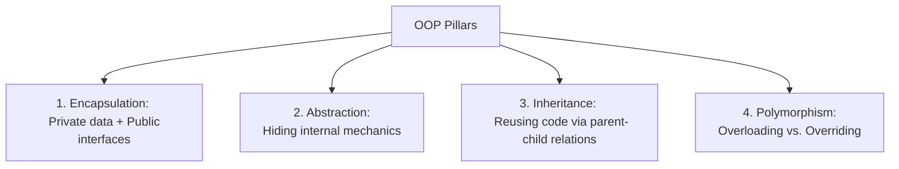

# ☕ Programming Languages — Unit IV: Complete Beginner-Friendly Notes

> **How to use these notes:** Read top to bottom. Every concept is explained with a simple analogy first, then the technical definition. Don't skip analogies — they are the key to truly *understanding* rather than just memorizing.

---

## 📌 Table of Contents

1. [C vs. C++ vs. Java Paradigm & Compilation](#1-c-vs-c-vs-java-paradigm--compilation)
2. [Pointers, Double Pointers & References](#2-pointers-double-pointers--references)
3. [Storage Classes (C/C++)](#3-storage-classes-cc)
4. [Object-Oriented Programming (OOP) Principles](#4-object-oriented-programming-oop-principles)
5. [Parameter Passing & Binding](#5-parameter-passing--binding)
6. [Memory Management (C++ Heap vs. Java Garbage Collection)](#6-memory-management-c-heap-vs-java-garbage-collection)

---

## 1. C vs. C++ vs. Java Paradigm & Compilation

### 🚗 The Car Analogy

- **C** is like a **manual kit car**. You must configure all gears, belts, and bolts yourself. It's incredibly fast and lightweight, but if you drop a bolt, the car will crash (**manual memory management, no protection**).
- **C++** is like a **sports car**. It has the speed of the manual car, but adds modern conveniences like cup holders, power steering, and turbo boost (**Classes, Templates, OOP**).
- **Java** is like a **self-driving electric car**. It handles the speed, steering, and maintenance automatically. It's safer and easier to drive, but it runs on a custom charging track (**Java Virtual Machine**) and is slightly heavier.

```
       C Source Code               C++ Source Code             Java Source Code
       (procedural)                  (OOP + multi)               (pure OOP)
            │                            │                            │
            ▼                            ▼                            ▼
       C Compiler                  C++ Compiler                 Java Compiler
      (e.g., GCC)                  (e.g., G++)                    (javac)
            │                            │                            │
            ▼                            ▼                            ▼
      Native Binary                Native Binary                JVM Bytecode
      (e.g., .exe/.out)            (e.g., .exe/.out)            (.class file)
    [Platform Dependent]         [Platform Dependent]         [Platform Independent]
                                                                      │
                                                                      ▼
                                                                     JVM
                                                              (Executes on OS)
```

---

## 2. Pointers, Double Pointers & References

### 📮 The Mailbox Analogy
- **Variable (`int x = 10;`):** A physical mailbox holding a letter with the number $10$ inside.
- **Pointer (`int *ptr = &x;`):** A sticky note containing the **street address** of the mailbox.
- **Dereferencing (`*ptr`):** Walking to the address written on the sticky note, opening the mailbox, and reading or modifying the letter inside.
- **Double Pointer (`int **dptr = &ptr;`):** A second sticky note containing the address of the *first sticky note*.

```
   Memory Address:   0x1001                 0x2002                 0x3003
   Variable:         [  10  ]  ◀─────────── [0x1001]  ◀─────────── [0x2002]
   Name:                x                     ptr                    dptr
   Type:               int                   int*                   int**
```

### 🔗 References vs. Pointers (C++)
*   **Pointer:** A separate variable holding an address. Can point to `NULL`, can be reassigned, and supports pointer arithmetic.
*   **Reference:** A direct alias/nickname for a variable. Cannot be `NULL`, must be initialized when declared, and cannot be changed to reference another variable.
    ```cpp
    int x = 10;
    int &ref = x; // ref is just a nickname for x. ref shares the same address as x.
    ```

---

## 3. Storage Classes (C/C++)

Storage classes define the scope (visibility), lifetime (how long it stays in memory), default value, and memory location of variables.

### 🏢 The Office Storage Analogy
*   **`auto` (Stack):** A **temporary scratchpad** on your desk. Useful only while working at your desk; thrown away when you leave the office.
*   **`register` (CPU):** A **quick desk drawer**. Extremely fast access, but limited space.
*   **`static` (Static Data Segment):** A **permanent bulletin board** in the office. It keeps its contents even when you go home, and is cleared only when the office closes down.
*   **`extern` (Global Data Segment):** A **public billboard** visible to everyone outside the building, letting different teams share the same resources.

| Storage Class | Keyword | Storage Location | Default Value | Scope | Lifetime |
| :--- | :--- | :--- | :--- | :--- | :--- |
| **Automatic** | `auto` | RAM Stack | Garbage value | Local (block) | Block exit |
| **Register** | `register` | CPU Register | Garbage value | Local (block) | Block exit |
| **Static** | `static` | RAM Data Segment| `0` | Local/Global | Program exit |
| **External** | `extern` | RAM Data Segment| `0` | Global | Program exit |

---

## 4. Object-Oriented Programming (OOP) Principles

OOP designs software around **data (objects)** rather than functions.

### 🏗️ 4.1 Class vs. Object
*   **Class:** A blueprint/template (e.g., an architect's drawing of a house). It consumes no physical space.
*   **Object:** The actual physical house built from the blueprint. It occupies physical memory.

---

### 🛡️ 4.2 The 4 Pillars of OOP



#### 1. Encapsulation (Data Hiding)
Bundles data and methods together inside a class and restricts direct modification using access specifiers:
- `private`: Accessible only within the class.
- `protected`: Accessible within the class and its child subclasses.
- `public`: Accessible from anywhere.

#### 2. Abstraction
Exposes only essential features while hiding the underlying implementation details. Achieved via:
- **Abstract Classes:** Can contain both concrete and abstract methods (must have at least one pure virtual function in C++: `virtual void run() = 0;`).
- **Interfaces:** Acts as a contract. In Java, contains only abstract methods and static constants.

#### 3. Inheritance
Allows a child class to inherit members of a parent class.
*   **The Diamond Problem:** Occurs in multiple inheritance if class $D$ inherits from $B$ and $C$, which both inherit from $A$. If $A$ has a method `show()`, and $D$ calls `show()`, it is ambiguous whether it should run $B$'s or $C$'s version.
    *   *C++ Solution:* Use `virtual inheritance`:
        ```cpp
        class B : virtual public A {};
        class C : virtual public A {};
        class D : public B, public C {}; // Only one copy of A is created
        ```
    *   *Java Solution:* Disallows multiple class inheritance. A class can only extend one parent class but can implement multiple interfaces.

#### 4. Polymorphism ("Many Forms")
*   **Compile-time (Static) Polymorphism:** Function/Operator Overloading.
    ```cpp
    int add(int a, int b);
    double add(double a, double b); // Same name, different parameter types
    ```
*   **Runtime (Dynamic) Polymorphism:** Method Overriding. Uses **Virtual Functions** resolved at runtime using **VTABLEs** and **VPTRs**.

```
Object in RAM:             VTABLE in Data Segment:
┌──────────────┐           ┌────────────────────────────┐
│   __vptr    ─┼──────────▶│ [0]: &Derived::speak()      │
├──────────────┤           │ [1]: &Base::run()          │
│  data fields │           └────────────────────────────┘
└──────────────┘
```

---

## 5. Parameter Passing & Binding

How arguments are passed to functions:

### 5.1 Parameter Passing Methods

#### Pass by Value
Passes a copy of the argument. Modifying it inside the function has no effect on the caller's variable.
```cpp
void update(int val) { val = 20; }
// if x = 10, update(x) leaves x as 10.
```

#### Pass by Address (Pointer)
Passes the memory address of the variable. Dereferencing modifies the caller's variable.
```cpp
void update(int *ptr) { *ptr = 20; }
// update(&x) changes x to 20.
```

#### Pass by Reference
Passes an alias for the variable. Modifies the caller's variable directly.
```cpp
void update(int &ref) { ref = 20; }
// update(x) changes x to 20.
```

---

### 5.2 Static vs. Dynamic Binding
*   **Static (Early) Binding:** The compiler links the function call to its definition at compile time (e.g., standard function calls and overloaded methods).
*   **Dynamic (Late) Binding:** The function call is resolved at runtime based on the actual object type (e.g., virtual/overridden methods).

---

## 6. Memory Management (C++ Heap vs. Java Garbage Collection)

### 🧺 The Warehouse Analogy (Stack vs. Heap)
- **Stack (Fast, Automatic):** Like a stack of dinner plates. You add to the top and remove from the top. When a function finishes, its plate is removed automatically, cleaning up all local variables.
- **Heap (Flexible, Manual):** Like a large warehouse floor. You can reserve space of any size, but you must keep track of where it is and clean it up when you are done.

```
STACK (Automatic LIFO)                 HEAP (Free Memory Pool)
┌───────────────────────┐              ┌───────────────────────────┐
│ [Local variables]     │              │  [Allocated Object 1]     │
│ [Return Addresses]    │              │  [Allocated Array]        │
│                       │              │                           │
│ Fast, compiler managed│              │  Requires manual free or  │
│                       │              │  Garbage Collection       │
└───────────────────────┘              └───────────────────────────┘
```

### 6.1 C++ Memory Management
*   **Keywords:** `new` (allocates on heap), `delete` (releases from heap).
*   **Issues:**
    *   **Memory Leak:** Allocating memory with `new` but forgetting to call `delete`. The memory remains occupied but unreachable.
    *   **Dangling Pointer:** A pointer pointing to a memory address that has already been deallocated using `delete`.
    *   **Double Free:** Calling `delete` twice on the exact same pointer, causing memory corruption.

---

### 6.2 Java Memory Management (JVM Garbage Collection)
*   Java allocates objects on the heap using `new` but does not have a `delete` keyword.
*   **Garbage Collector (GC)** runs in the background to automatically identify and reclaim unreachable objects on the heap.
*   **Mark-and-Sweep Algorithm:**
    1.  **Mark:** Starting from **GC Roots** (active local variables, static references), traverse the object graph and mark all reachable objects.
    2.  **Sweep:** Scan the heap and release the memory of all unmarked (unreachable) objects.

```
  GC Roots ──▶ [Object A (Reachable)] ──▶ [Object B (Reachable)]
               [Object C (Unreachable)]  ◀── Mark & Sweep deletes this!
```
