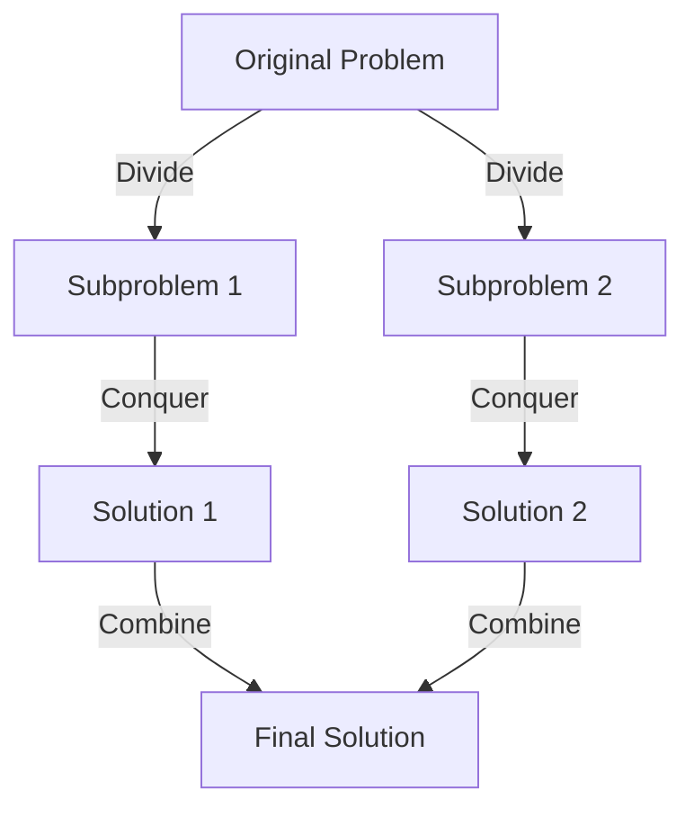

# ⚙️ Algorithms — Unit VI: Complete Beginner-Friendly Notes

> **How to use these notes:** Read top to bottom. Every concept is explained with a simple analogy first, then the technical definition. Don't skip analogies — they are the key to truly *understanding* rather than just memorizing.

---

## 📌 Table of Contents

1. [Understanding Algorithms & Complexity](#1-understanding-algorithms--complexity)
2. [Asymptotic Notations](#2-asymptotic-notations)
3. [Recurrences & The Master Theorem](#3-recurrences--the-master-theorem)
4. [Sorting Algorithms Comparison](#4-sorting-algorithms-comparison)
5. [Divide & Conquer Strategy](#5-divide--conquer-strategy)
6. [Dynamic Programming (DP)](#6-dynamic-programming-dp)
7. [Greedy Algorithms](#7-greedy-algorithms)

---

## 1. Understanding Algorithms & Complexity

### 🧁 The Baking Analogy

An **Algorithm** is a **baking recipe**:
- **Input:** Raw ingredients (eggs, flour, sugar).
- **Steps:** Mix, preheat, bake for 30 minutes, cool.
- **Output:** A finished cake.

When analyzing recipes:
- **Time Complexity** is not measured in minutes (as a faster oven changes this). It is measured by the **number of operations** (e.g., if you double the cake size, do you need to stir twice as many times?).
- **Space Complexity** is the number of **mixing bowls** (extra memory) needed during the baking process.

---

## 2. Asymptotic Notations

Asymptotic notations describe how an algorithm's runtime scales as the input size $N$ grows toward infinity.

```
  Runtime
    ▲            /   ← Upper Bound: O(f(N)) - Worst Case
    │           /
    │   ───────/──   ← Tight Bound: Θ(f(N)) - Average Case
    │         /
    │        /       ← Lower Bound: Ω(f(N)) - Best Case
    └────────┴────────────▶ Input Size (N)
```

1.  **Big-O ($O$) — Upper Bound (Worst Case):**
    - Guarantees that the algorithm will never take longer than this limit. It describes the maximum number of operations.
2.  **Big-Omega ($\Omega$) — Lower Bound (Best Case):**
    - Guarantees the algorithm will take at least this much time.
3.  **Big-Theta ($\Theta$) — Tight Bound (Average Case):**
    - Decribes the exact runtime behavior when the upper and lower bounds match.

### 📐 Growth Rate Hierarchy (Must Memorize!)
Algorithms are ordered from fastest (best) to slowest (worst):

$$O(1) < O(\log N) < O(N) < O(N \log N) < O(N^2) < O(2^N) < O(N!)$$

---

## 3. Recurrences & The Master Theorem

A **Recurrence Relation** describes the runtime of a recursive function by expressing it in terms of smaller inputs (e.g., $T(N) = 2T(N/2) + N$).

### 🛠️ The Master Theorem
For recurrences of the form:
$$T(N) = aT(N/b) + \Theta(N^d)$$
where $a \ge 1$ (number of subproblems), $b > 1$ (factor by which size is divided), and $d \ge 0$ (exponent of work done outside recursion).

We compare $d$ with $\log_b a$:

*   **Case 1: $d < \log_b a$**
    - The recursive subproblems dominate the work.
    - $$T(N) = \Theta(N^{\log_b a})$$
*   **Case 2: $d = \log_b a$**
    - The work is equal at all levels of the recursion tree.
    - $$T(N) = \Theta(N^d \log N)$$
*   **Case 3: $d > \log_b a$**
    - The work done dividing/combining dominates.
    - $$T(N) = \Theta(N^d)$$

#### Practical Recurrence Solvers
- **Merge Sort:** $T(N) = 2T(N/2) + N$
  - $a=2, b=2, d=1 \implies \log_2 2 = 1$. Since $d = \log_b a = 1$ (Case 2):
  - $$T(N) = \Theta(N \log N)$$
- **Binary Search:** $T(N) = T(N/2) + 1$
  - $a=1, b=2, d=0 \implies \log_2 1 = 0$. Since $d = \log_b a = 0$ (Case 2):
  - $$T(N) = \Theta(\log N)$$

---

## 4. Sorting Algorithms Comparison

Sorting rearranges elements in an array in a specific order (ascending or descending).

*   **Stability:** A sorting algorithm is stable if it preserves the relative order of duplicate elements.
*   **In-Place:** An algorithm is in-place if it requires $O(1)$ extra space during sorting.

| Algorithm | Best Case | Average Case | Worst Case | Space Complexity | Stable? | In-Place? |
| :--- | :--- | :--- | :--- | :--- | :--- | :--- |
| **Bubble Sort** | $O(N)$ | $O(N^2)$ | $O(N^2)$ | $O(1)$ | Yes | Yes |
| **Selection Sort** | $O(N^2)$ | $O(N^2)$ | $O(N^2)$ | $O(1)$ | No | Yes |
| **Insertion Sort** | $O(N)$ | $O(N^2)$ | $O(N^2)$ | $O(1)$ | Yes | Yes |
| **Merge Sort** | $O(N \log N)$ | $O(N \log N)$ | $O(N \log N)$ | $O(N)$ | Yes | No |
| **Quick Sort** | $O(N \log N)$ | $O(N \log N)$ | $O(N^2)$ | $O(\log N)$ | No | Yes |
| **Heap Sort** | $O(N \log N)$ | $O(N \log N)$ | $O(N \log N)$ | $O(1)$ | No | Yes |

---

## 5. Divide & Conquer Strategy

**D&C** works by breaking a problem down into smaller subproblems, solving them recursively, and combining their results.



### Key D&C Algorithms
1.  **Merge Sort:** Divides the array in half, sorts each half recursively, and merges the sorted halves in $O(N)$ time.
2.  **Quick Sort:** Selects a pivot element, partitions the array (elements smaller than pivot to the left, larger to the right), and recursively sorts the partitions.
3.  **Binary Search:** Discards half of the remaining elements at each step, searching in $O(\log N)$ time.

---

## 6. Dynamic Programming (DP)

### 💰 The Money Savings Analogy
If I ask you: *"What is $1 + 1 + 1 + 1 + 1$?"*
You count and say: *"Five."*
Now, if I add another $+ 1$ to the board and ask: *"What is the sum now?"*
You don't start counting from the beginning. You remember the previous sum was 5, add 1, and say: *"Six."*

You remembered the previous result to save calculation time. This is **Dynamic Programming**.

### 6.1 Core Properties
1.  **Optimal Substructure:** The optimal solution to the problem can be constructed from the optimal solutions of its subproblems.
2.  **Overlapping Subproblems:** The recursive program solves the same subproblems repeatedly.

#### Memoization vs. Tabulation
*   **Memoization (Top-down):** Write the solution recursively, caching results in a lookup table (dictionary/array) before returning.
*   **Tabulation (Bottom-up):** Solves base cases first and fills a table iteratively.

---

### 🎒 6.2 The 0/1 Knapsack Problem Walkthrough

You have a knapsack with a weight capacity of **$W = 5$**. You want to select a subset of items to maximize the total value:

| Item | Weight ($w$) | Value ($v$) |
| :--- | :--- | :--- |
| **1** | 1 | 12 |
| **2** | 2 | 10 |
| **3** | 3 | 20 |
| **4** | 4 | 15 |

We construct a 2D table `dp[i][w]`, where `i` represents the items considered (0 to 4) and `w` represents the remaining capacity (0 to 5):

$$\text{DP Recurrence: } dp[i][w] = \max(dp[i-1][w], \ v_i + dp[i-1][w - w_i])$$

#### The DP Grid:
- Row 0 (no items): All 0s.
- Column 0 (capacity 0): All 0s.

```
   Cap (w):  0     1     2     3     4     5
Item 0 (None):[0]   [0]   [0]   [0]   [0]   [0]
Item 1 (w=1): [0]  [12]  [12]  [12]  [12]  [12]
Item 2 (w=2): [0]  [12]  [12]  [22]  [22]  [22]
Item 3 (w=3): [0]  [12]  [12]  [22]  [32]  [32]
Item 4 (w=4): [0]  [12]  [12]  [22]  [32]  [32]  ◀── MAX VALUE = 32!
```

- **Explanation for `dp[2][3]` (Item 2, Cap 3):**
  - Option 1 (exclude Item 2): Value from row above `dp[1][3]` = 12.
  - Option 2 (include Item 2): Value of Item 2 (10) + value from remaining capacity `dp[1][3 - 2]` = $10 + 12 = 22$.
  - $\max(12, 22) = 22$.

---

## 7. Greedy Algorithms

**Analogy:** You are given 10 seconds to grab as many bills as possible from a cash pile. You grab the ₹2000 bills first, then the ₹500 bills, and so on. You don't calculate combinations; you make the **immediate, locally optimal choice**.

```
    Dynamic Programming                   Greedy Strategy
┌─────────────────────────┐         ┌─────────────────────────┐
│ Calculates all options  │         │ Makes locally optimal   │
│ before making choice.   │         │ choice immediately.     │
│ Slow but always optimal.│         │ Fast, but not always    │
│                         │         │ globally optimal.       │
└─────────────────────────┘         └─────────────────────────┘
```

### Key Greedy Algorithms
1.  **Huffman Coding:** A lossless data compression algorithm. It assigns variable-length binary codes to characters based on their frequencies.
2.  **Dijkstra's Algorithm:** Finds the single-source shortest path in a graph. It assumes all edge weights are positive.
3.  **Kruskal's & Prim's Algorithms:** Construct the Minimum Spanning Tree (MST) of a graph. Kruskal's sorts all edges; Prim's grows the tree vertex-by-vertex.
4.  **Fractional Knapsack:** Unlike 0/1 Knapsack, you can take fractions of items. This can be solved optimally using a Greedy strategy by sorting items by their value-to-weight ratio.
