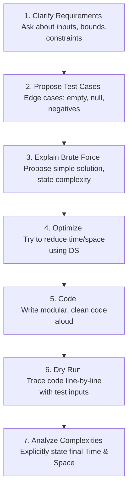

# 🤝 Interview Prep — Unit VII: Complete Beginner-Friendly Notes

> **How to use these notes:** Read top to bottom. Every concept is explained with a simple analogy first, then the technical definition. Don't skip analogies — they are the key to truly *understanding* rather than just memorizing.

---

## 📌 Table of Contents

1. [Technical Resume Building](#1-technical-resume-building)
2. [The Live Coding Interview Workflow](#2-the-live-coding-interview-workflow)
3. [The STAR Method for Behavioral Interviews](#3-the-star-method-for-behavioral-interviews)
4. [Target Prep for Service-Oriented IT Companies](#4-target-prep-for-service-oriented-it-companies)

---

## 1. Technical Resume Building

### 🏪 The Shop Window Analogy

Think of your resume as a **high-end shop window**:
- Passing customers (recruiters) spend only **6 seconds** looking at it before choosing to walk in or keep walking.
- If the window is crowded, cluttered, or dusty (typos, ugly fonts, 3 pages long), people walk away.
- You should display only your best items, arranged neatly, with clear labels and price tags.

---

### 1.1 Structural Guidelines for a Tech Resume

1.  **Format:** One page. Single column. Use standard fonts (Arial, Calibri) and clean markdown sections. Avoid visual templates, icons, progress bars, or charts, which can confuse **Applicant Tracking System (ATS)** parsers.
2.  **Contact Info:** Name, phone, email, LinkedIn, and GitHub links at the top.
3.  **Skills Section:** Group skills logically.
    - *Languages:* C++, Java, SQL
    - *Tools:* Git, Docker
4.  **Projects Section:** Showcase 2-3 projects using the **X-Y-Z formula**:
    - **Formula:** *Accomplished [X], as measured by [Y], by doing [Z].*
    - *Bad Bullet:* *"Built a database app with SQL."*
    - *Good Bullet:* *"Optimized database read queries [X], reducing latency by 40% [Y], by implementing B+ Tree indexing and query refactoring [Z]."*

---

## 2. The Live Coding Interview Workflow

### 🤝 The Co-Worker Analogy
A coding interview is not a test where you sit in silence and hand in a paper. It is a **collaborative design session**. The interviewer wants to see what it is like to work with you as a co-engineer on a production team.

---

### 2.1 The Whiteboard Coding Workflow
Never start writing code immediately after hearing a problem. Follow this step-by-step process:

*   **Step 1: Clarify Requirements**
    - Ask questions about the input and output.
    - *Verbal Cue:* *"Are the input numbers always positive? Can the array contain duplicates? What are the size limits?"*
*   **Step 2: Propose Test Cases**
    - Design normal cases, and then identify edge cases (e.g., empty array, null input, negative values).
*   **Step 3: Explain Brute Force**
    - Propose a simple, brute-force solution. State its time and space complexities.
    - *Verbal Cue:* *"A naive approach would be nested loops, taking $O(N^2)$ time. Let me explain that first."*
*   **Step 4: Optimize**
    - Propose a better data structure or algorithm to reduce the complexity (e.g., using a Hash Table to reduce $O(N^2)$ to $O(N)$).
*   **Step 5: Code**
    - Write clean, modular code. **Think aloud** as you write, explaining each line's logic.
*   **Step 6: Dry Run**
    - Trace your code line-by-line using a test case. Do not run it in your head; track variable states explicitly on the board.
*   **Step 7: Analyze Complexities**
    - Explicitly state the final Time and Space complexities of your solution.

---

## 3. The STAR Method for Behavioral Interviews

### 📖 The Storytelling Analogy
If someone asks you: *"Are you good under pressure?"*
If you answer: *"Yes, I am very good under pressure,"* it is not convincing. 
Instead, tell them a **story** about a time you resolved a major production issue under a tight deadline, structuring your narrative to highlight the situation, task, action, and result.

---

### 3.1 The STAR Framework

| Component | What to say |
| :--- | :--- |
| **S - Situation** | Set the context. *"In my database course project, our team had a problem where..."* |
| **T - Task** | Describe the challenge. *"I was responsible for optimizing the SQL queries to prevent timeouts..."* |
| **A - Action** | Explain what *you* did. *"I analyzed the execution plan, added clustered indexes, and refactored the JOIN queries by..."* |
| **R - Result** | Detail the outcome. *"As a result, query latency dropped by 95% and our team secured an A grade."* |

> ⚠️ **Important:** When describing the **Action**, focus on *your* contributions. Use **"I did..."** instead of "We did..." to ensure the interviewer can evaluate your individual performance.

---

## 4. Target Prep for Service-Oriented IT Companies

Companies like TCS, Infosys, Wipro, and Cognizant have specific hiring patterns.

### 4.1 Typical Recruitment Process
1.  **Aptitude Test:** Quantitative math, logical reasoning, and verbal comprehension.
2.  **Technical MCQ Round:** Checks CS fundamentals (OS scheduling, OSI layers, SQL Joins, OOP basics, and basic C/Java pseudocode tracing).
3.  **Coding Round:** Typically focuses on basic array/string manipulations and arithmetic logic (e.g., reversing strings, prime checks, matrix operations).
4.  **HR Interview:** Evaluations of relocation flexibility, communication skills, and willingness to learn new tools.

### 4.2 Preparation Strategy
*   **Aptitude:** Practice quick mental math and logical puzzles.
*   **CS Fundamentals:** Review SQL Joins, ACID properties, OOP concepts, and process state transitions.
*   **Flexibility:** Express adaptability and willingness to relocate or learn new tools during the HR round, as service companies value resource flexibility for staffing client projects.
